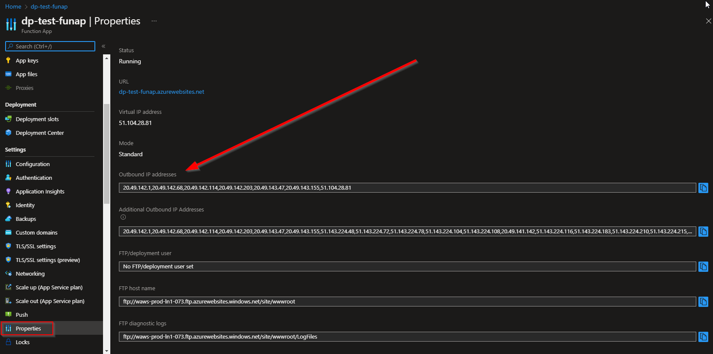
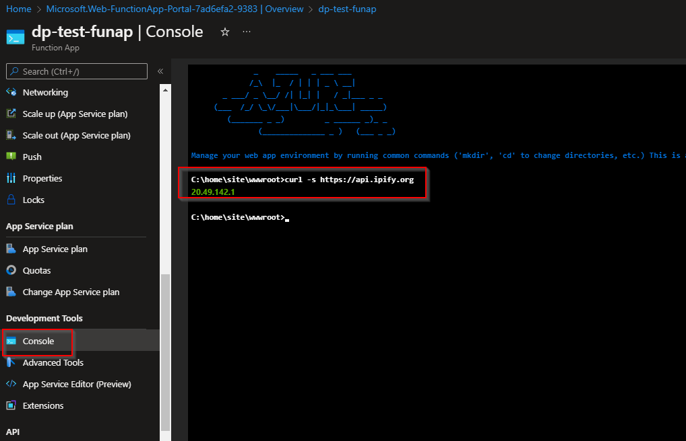
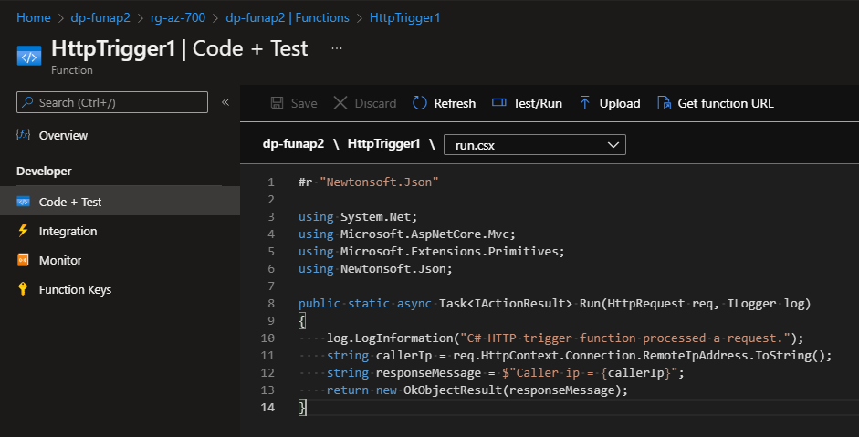
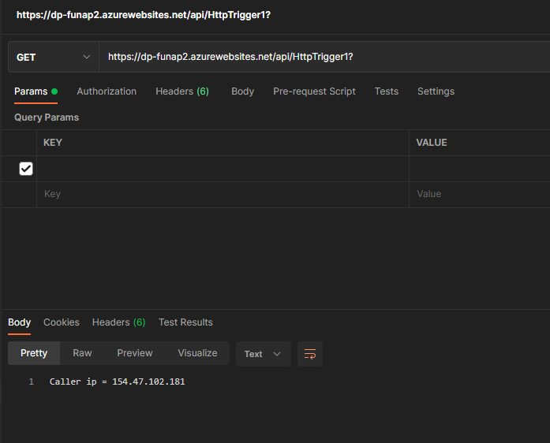

# Introduction
It is quite useful to know the outbound IP address of an Azure function app or an app service. Both these services are the same under the hood, hence the following techniques apply to both.


# Finding the outbound IP address

## Check under properties for all possible ones

Under the app (function app or app service) properties we can see the list of outbound IP address that Azure can possibly use.



This tab shows a whole list of IP addresses and not the specific IP actually used for an outbound request. Also if app is vnet integrated and the subnet has a route table, these IPs won't be used. So the best source of truth will be doing an outbound request from the app's console. Let's see how next.

## Use console to find IP for specific request

This trick uses as free service called `https://www.ipify.org/`.



We go into the app's console and type the following command:

```
C:\home\site\wwwroot>curl -s https://api.ipify.org
```

That should return the outbound IP from which the request went to `ipify` service.

### Mimic ipipfy using own service
We can also create our own service e.g. an Azure function.


</br>

The dotnet code below can return the caller's IP
```
#r "Newtonsoft.Json"

using System.Net;
using Microsoft.AspNetCore.Mvc;
using Microsoft.Extensions.Primitives;
using Newtonsoft.Json;

public static async Task<IActionResult> Run(HttpRequest req, ILogger log)
{
    string responseMessage = $"Caller ip = {req.HttpContext.Connection.RemoteIpAddress.ToString()}";
    return new OkObjectResult(responseMessage);
}
```

We can call the service using postman to test or from console of another app



# Conclusion
Hope this was useful and saved you some time. Please do share your learnings. If you have any thoughts or comments please do get in touch with me on Twitter [@rubberduckdev](https://twitter.com/rubberduckdev). Or use the Disqus plugin below.