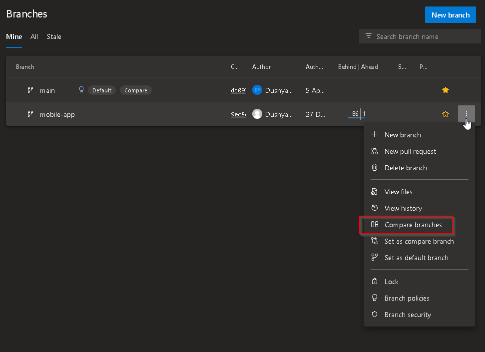

This is a nice trick, which I was not aware of, even though I have been using Azure DevOps for many years. So thought will write a post about it so hopefully someone else benefits from this.

When working with multiple branches in a repository, it's useful to compare them to understand the differences and ensure that changes are correctly merged. Azure DevOps provides a straightforward way to compare branches and review the changes.

### Step-by-Step Guide

1. **Navigate to Your Repository**
   - Open your Azure DevOps project.
   - Go to the "Repos" section from the left-hand menu.
   - Select the repository you want to work with.

2. **Select the Branches**

   - Click on the "Branches" tab to view all the branches in your repository.
   - Identify the two branches you want to compare.

3. **Initiate the Comparison**
   - Click on the branch you want to compare from.
   - In the branch details view, click on the "Compare" button.

4. **Choose the Target Branch**
   - In the comparison view, select the target branch you want to compare against from the dropdown menu.
   - Azure DevOps will display the differences between the two branches, including commits, file changes, and code differences.

5. **Review the Changes**
   - Use the comparison view to review the changes between the branches.
   - You can see the list of commits, files that have been changed, added, or deleted, and the specific code differences.

### Conclusion

Comparing branches in Azure DevOps helps in maintaining code quality and collaboration within your team. By following these steps, you can easily compare branches, review changes, and make informed decisions about merging.

---

I hope this helps! If you have any questions or need further assistance, feel free to ask.