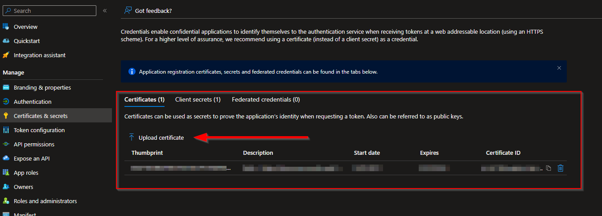
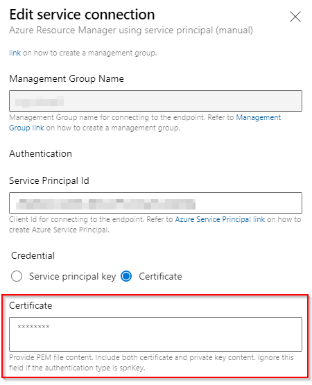

*Banner from [wixstatic](https://static.wixstatic.com/media/f88c3e_95320527a1014a50afe209e77b955882~mv2.png/v1/fit/w_890%2Ch_488%2Cal_c/file.png)*

# Introduction
Azure DevOps service connection to Azure, using a Service Principal can use a secret (a password) or a certificate. In this post, I am sharing how I recently used a certificate to achieve authentication for a service connection. As described in this [MS Community post](https://learn.microsoft.com/en-us/answers/questions/296997/creating-and-using-certificates-for-azure-sevice-p.html), we can use a certificate (AsymmetricX509Cert) with any type of issuers like Self-Sign, Public or Internal CA. Self-signed is the easiest approach, in my opinion, it mimics the same logic of us setting a password and resetting it when it expires.


# Generating a self-signed certificate
There is a difference between the certificates we upload for Azure Service Principal and the Azure DevOps service connection.

## Azure Service Principal Certificate


We need to upload a certificate (public key) with one of the following file types: .cer, .pem, .crt. And it has to be the public key only.

## Azure DevOps Service Connection Certificate


In Azure DevOps service connection we need to provide PEM file content. Include both certificate and private key content. This is different to what we uploaded onto the Azure service principal.

## Generation script

### Pre-requisite

We need `OpenSSL` installed. It can be installed using [Chocolatey](https://community.chocolatey.org/packages/openssl).

### The script
So I followed a few blogs such as [Certificate-based auth with Azure Service Principals from Linux command line](https://arsenvlad.medium.com/certificate-based-auth-with-azure-service-principals-from-linux-command-line-a440c4599cae) and [Azure DevOps – use certificate for Azure Service Connection SPN](https://securecloud.blog/2021/04/13/azure-devops-use-certificate-for-azure-service-connection-spn/) and put together the following PowerShell script which generates the certificates in the correct format and also shows a helpful message on where to use which one:

[Github gist](https://gist.github.com/realrubberduckdev/14b38960a66bb33365af3aaadafcebc9#file-generateselfsignedcertificate-ps1) available.
```
param (
    [string]$CertificateNamePrefix,
    [int]$ExpiryInDays
)

$unsecurePassword = Read-Host "Enter password for certificate" -AsSecureString

$certFileName = "$CertificateNamePrefix-cert.pem"
$certPrivateKeyFileName = "$CertificateNamePrefix-key.pem"
$certPackFileName = "$CertificateNamePrefix-pack.pfx"
$certPemWithBagAttributesFileName = "$CertificateNamePrefix-PemWithBagAttributes.pem"

# generate cert.pem to be uploaded for spn
openssl req -x509 -days $ExpiryInDays -newkey rsa:2048 -keyout $certPrivateKeyFileName -out $certFileName
Read-Host “Check that $certFileName and $certPrivateKeyFileName are generated. Then press ENTER to continue...”

# generate pack to put private key and cert (public key) together
openssl pkcs12 -inkey $certPrivateKeyFileName -in $certFileName -export -out $certPackFileName -passout "pass:$unsecurePassword"
Read-Host “Check that $certPackFileName is generated. Then press ENTER to continue...”

# generate merged pem for pasting into Azure DevOps servce connection configuration
openssl pkcs12 -in $certPackFileName -passin "pass:$unsecurePassword"  -out $certPemWithBagAttributesFileName -nodes

Write-Host "Upload $certFileName to Azure Service principal."
Write-Host "Copy and paste content of $certPemWithBagAttributesFileName in Azure DevOps service connection certificate textbox."
```

For example, a test run can look like this:
```
PS C:\> .\GenerateSelfSignedCertificate.ps1 -CertificateNamePrefix TestAdos -ExpiryInDays 730
Enter password for certificate: ******
Generating a RSA private key
.............+++++
.......................................................................+++++
writing new private key to 'TestAdos-key.pem'
Enter PEM pass phrase:
Verifying - Enter PEM pass phrase:
-----
You are about to be asked to enter information that will be incorporated
into your certificate request.
What you are about to enter is what is called a Distinguished Name or a DN.
There are quite a few fields but you can leave some blank
For some fields there will be a default value,
If you enter '.', the field will be left blank.
-----
Country Name (2 letter code) [AU]:UK
State or Province Name (full name) [Some-State]:.
Locality Name (eg, city) []:.
Organization Name (eg, company) [Internet Widgits Pty Ltd]:.
Organizational Unit Name (eg, section) []:.
Common Name (e.g. server FQDN or YOUR name) []:.
Email Address []:.
Check that TestAdos-cert.pem and TestAdos-key.pem are generated. Then press ENTER to continue...:

Enter pass phrase for TestAdos-key.pem:
Check that TestAdos-pack.pfx is generated. Then press ENTER to continue...:

Upload TestAdos-cert.pem to Azure Service principal.
Copy and paste content of TestAdos-PemWithBagAttributes.pem in Azure DevOps service connection certificate textbox.
PS C:\dev\setup-dev-evn\AzureAutomation\self-signed-cert-generation>
```

# Conclusion
This script is useful as it helps create both the different certificates which we need to use as well as provides a helpful message saying which one goes where. Hope this was useful and saved you some time. Please do share your learnings. If you have any thoughts or comments please do get in touch with me on Twitter [@rubberduckdev](https://twitter.com/rubberduckdev). Or use the Disqus plugin below.
