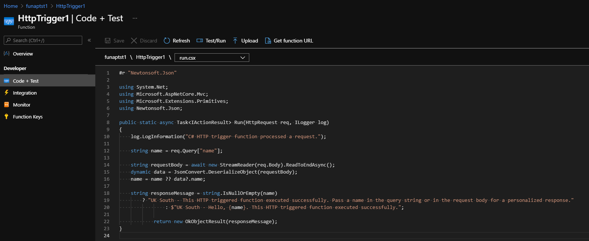
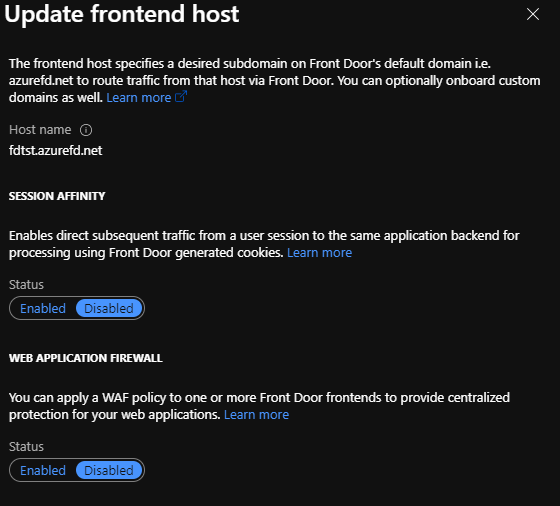
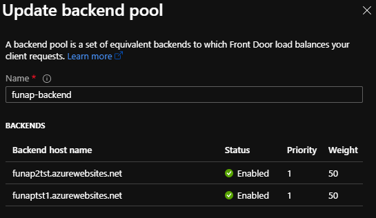
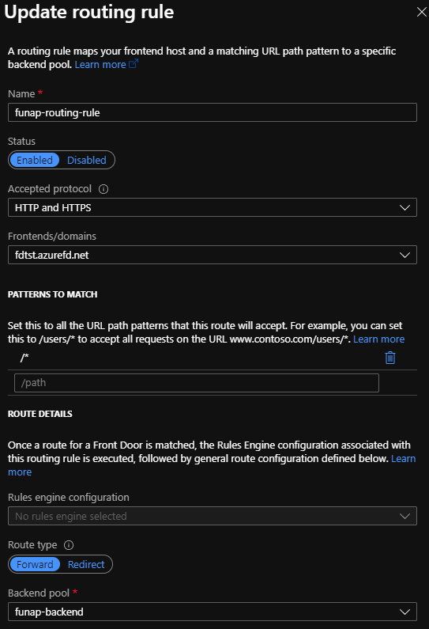
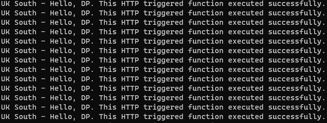

# Azure Front Door

In this post, we will see a simple active-active configuration using Azure Front Door. As per [Microsoft documentation](https://docs.microsoft.com/en-us/azure/frontdoor/front-door-overview), Azure Front Door is a global, scalable entry-point that uses Microsoft global edge network to create fast, secure, and widely scalable web applications. So it does a lot more than what we are looking at in this post.

# Active active configuration

In the world disaster recovery, an active-active configuration is really useful as both (at least 2) services behind a load balancer are constantly in use. So if one goes down, the other one keeps serving requests.

## Architecture

In our architecture diagram below, we will use two azure functions to run in an active-active mode with an Azure Front Door acting as a load balancer.


Note that both the function apps are in different regions, meaning in case of a disaster taking out one region, the other can keep working. We can span it to more regions depending on the requirements.

## Function app configuration

In our case, we are deploying an HTTP triggered with anonymous authorization (to keep the setup simple). In the response message, we just specify the region it is hosted in so we can see it in our logs when we test it.


<br/>

The anonymous authorization is to keep the setup simple when we test it.


<br/>

## Azure front door and function app configuration

On the front door, we provide a hostname/domain name which is what the users will send requests to.


<br/>

In the backend pool, we add both the function apps, keeping both `priority 1` and `weight 50`. So they will both remain active and continue servicing requests.


<br/>

We do a simple pattern match `/*` so all requests are directed to the only backend pool we have.


<br/>

## Testing

We can use a small PowerShell script that keeps posting requests to our front door URL.

```
$requestBody = @'
{
    "name": "DP"
}
'@

do {
    $response = Invoke-WebRequest -Uri https://fdtst.azurefd.net/api/HttpTrigger1 -Method POST -Body $requestBody
    Write-Host $response.Content
} while ($true)

$response = Invoke-WebRequest -Uri https://fdtst.azurefd.net/api/HttpTrigger1 -Method POST -Body $requestBody
Write-Host $response.Content
```

When we first start running the script, we see it keeps getting a response from the UK south, mainly because I am closest to that data centre.
<br/>


<br/>

Then we go ahead and stop the UK south function app to simulate an outage from the region.

<br/>

That immediately results in failing requests and this happens until the front door realizes that the backend pool is no longer available.
<br/>


<br/>

The azure front door keeps trying UK South, while now serving requests via UK West.
<br/>


<br/>

And finally, once Azure front door establishes that UK South is unhealthy, it sticks to UK West.
<br/>


<br/>

# Conclusion

This was a simple setup to test how to implement an active-active configuration. This can be done in a far better way with an understanding of Azure SLAs to ensure we get a high availability guarantee.
