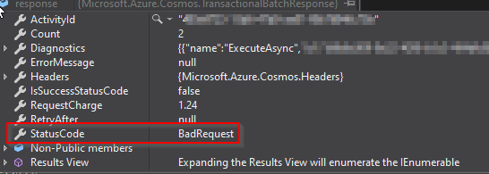

# Introduction
Azure Cosmos DB provides a great way to perform [transactional batch operations using the .Net SDK](https://docs.microsoft.com/en-us/azure/cosmos-db/transactional-batch). This operation method provides the [ACID](https://en.wikipedia.org/wiki/ACID) guarantees and so it makes it much easier to perform multiple steps in one transactional batch or fail and roll back the whole operation.

# Dealing with BadRequest StatusCode
The Microsoft documentation link above does a fantastic job of explaining how to implement a transactional batch operation, so won't go much into that. But when I was trying it out, I kept getting `StatusCode=BadRequest` and it can be quite difficult to find out why that happens.
<br/>

<br/>
I have been unable to find out details from the response object.

```
var result = response.GetOperationResultAtIndex<Customer>(0);
```
Even the OperationResult wasn't helpful, check the image below. Note that, `Customer` is the object I am trying to write to the database.

Say we have a function `GetResponse` like below:
<br/>

<br/>
## Finding out the issue

The only way I could find out what the issue was by completely ditching the `TransactionalBatch` method and test it using

```
await container.CreateItemAsync<Customer>(customerItem, new PartitionKey(customerItem.Id));
```

And this now led me to another exception, which was a bit easier to understand.

```
PartitionKey extracted from document doesn't match the one specified in the header on CreateItemAsync
```

## Explanation
So if you have followed the Microsoft documentation, [it lists two limitations](https://docs.microsoft.com/en-us/azure/cosmos-db/transactional-batch#limitations). The bit that it doesn't list, which seems to be by design is a `TransactionalBatch` can only work in a single `Partition`.

```
TransactionalBatch batch = container.CreateTransactionalBatch(new PartitionKey(customer.PartitionKey))
```

So when we try to get the container, we have to specify the `PartitionKey` too as the second argument.
```
var container = await database.CreateContainerIfNotExistsAsync("CustomerInfo", "/id");
```

And both the partition keys need to be the same, otherwise `TransactionalBatch` will keep throwing a `BadRequest`.

## Solution
This [stackoverflow post](https://stackoverflow.com/questions/58121736/partitionkey-extracted-from-document-doesnt-match-the-one-specified-in-the-head) touches on the solution. So overall we need to ensure our `Customer` class has a `PartitionKey` which Cosmos DB can serialize.
```
public class Customer
  {
    [JsonProperty(PropertyName = "id")] // This is needed by Cosmos DB
    public string? Id { get; set; }

    [JsonProperty(PropertyName = "CustomerPartition")] // This is needed by Cosmos DB. Note that it cannot take any special characters, not even hyphen.
    public string? CosmosPartitionKey { get; set; } = "CustomerPartition";

  }
```

Along with this we also need to ensure the `Container`, as well as `TransactionalBatch`, are pointing to the same `PartitionKey`.

```
string partitionKey = "CustomerPartition";
var container = await database.CreateContainerIfNotExistsAsync("CustomerInfo", $"/{partitionKey}");
TransactionalBatch batch = container.CreateTransactionalBatch(new PartitionKey(partitionKey))
```

# Conclusion
Hope this was useful and saves you some time if you are trying this out. If you have any thoughts or comments please do get in touch with me on Twitter [@rubberduckdev](https://twitter.com/rubberduckdev). Or use the Disqus plugin below.
