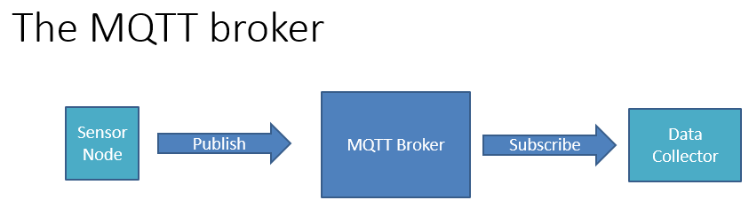

# Developer! Developer! Developer! Day
The DDD14 held at Reading on 12th Oct 2019 was my first ever experience of [Developer Developer Developer](https://developerdeveloperdeveloper.com/Home/About) community event. It is a fantastic event and I have been missing out by not attending it in the past. The quality of speakers and the content of presentation is amazing, add to it the great organization and location (it was at Microsoft UK HQ at Thames Valley Park). If you are a member of the software community, definitely do not miss out on this great event.

Here are few of the talks I could attend on the day.

# How to steal an election
By [Gary Short](http://www.twitter.com/@garyshort).

This was a great talk to start with. It comes with a controversial title and goes on to excite and amaze the audience with explanation of multiple techniques that can be applied and to a large extent is actually applied to steal an election. By 'steal an election', as was explained by Gary, it means "to illegally/immorally influence a result contrary to the current mood of the electorate".

We may already be aware of many of the techniques used by political parties to try influence their voters such as 
Caging: where hostile voters are stripped or their right to vote or discouraged enough to not to vote.
Gerrymandering: re-architect district borders to gain a numbers advantage.
Tossing: creating situations when votes casted can be discarded as invalid.

Although the extra exciting bit provided was the real world examples used by Gary to show how some parties are currently doing it. He goes to use the audience to participate in something which we would normally wouldn't agree to do, in order to prove how influence works.

Overall, both scary and exciting and the full video is available on [Youtube - How to Steal an Election - Gary Short](https://youtu.be/32m8luvA9Qg).

# Air Quality, Azure Functions and Spider Eggs
By [Rob Miles](http://www.twitter.com/@robmiles).

This talk is actually about IoT devices, use of Microsoft Azure technologies as well as measuring air quality, well just to start of with, but is actually a whole lot more. It was clear how passionate Rob is towards his projects and technology in general and it showed in his presentation when he insisted on trying hobby projects is the best way to learn.

From the air quality measurement side of things, Rob did come with some amazing gadgets and a classy top hat (with air quality sensors on it). To begin with he demonstrated connecting a device using [Message Queue Telemetry Transport] (https://en.wikipedia.org/wiki/MQTT) with a simplified architecture as below.

Following this, the talk was more about using Azure IoT Hub and Azure Functions for managing MQTT messages and interacting with the devices.

Among many devices, Rob described using LoRaWAN to design cow tracking devices and leaving it our imagination to use it for other creative solutions. All this and more is available at [Rob's github](https://github.com/CrazyRobMiles/DDD-Reading-2019) account including all source code.

# Internationalising your applications
By [Pete Vickers](http://www.twitter.com/@petevick)

Microsoft's [Multilingual App Toolkit](https://docs.microsoft.com/en-us/windows/uwp/design/globalizing/use-mat) was the main focus point of this talk. Pete presented how the process of translation is now comparatively easier with the use the toolkit. The demonstration was on Pete's [Restaurant App](http://www.gui-innovations.com/restaurant-app.html). The demonstration included complicated cases of languages which are written from right to left (such as Arabic or Hebrew, although only Arabic was included in the demo), languages with double-byte character set such as Japanese and also languages that have umlaut or similar notations such as German.

# Typescript for the C# developer
By [Peter Shaw](http://www.twitter.com/@shawty_ds)

Peter presented a great take on Typescript from a C# developer's perspective. While playing to the dislike we share towards JavaScript due to its anomalistic behaviour, Peter advocated adoption of Typescript which I wholeheartedly agree with. One of the most funny bits of the presentation was the clip from Gary Bernhardt's talk titled Wat, again showing how complicated JavaScript can be. If you have not already seen the video, do take a look at [Wat](https://www.destroyallsoftware.com/talks/wat), I promise you that it is hilarious.

While promising not to dive in-depth into the world of Typescript, Peter starts off with clearing up many misconceptions we might have about Typescript. Followed by the explaining how the goodness of C# which we miss in JavaScript is present in Typescript. Having said so, Typescript has its own complications as well, the 'null vs undefined madness' for example.

Do check out the [slides](http://files.digital-solutions.me.uk/presentations/typescript.pdf) of the fantastic talk.

# .Net Configuration is Easy ... Right?
By [Steve Collins](http://www.twitter.com/@stevetalkscode)

Steve starts with a brief overview of the history of configuration in .NET Framework and how things have changed for dotnet core, some for the good while some issues still remain.

The best bit of the talk is that it suggests a "SOLID" based approach that makes configuration not only fully testable, but adds enhancements to handle encrypted configuration values. In order to achieve this, Steve makes use of multiple design patterns and mainly focusess on [Bridge pattern originally suggested by Gang of Four](http://www.blackwasp.co.uk/gofpatterns.aspx).

The code for this demo and a link to Steve's blog post are available at [his github](https://github.com/configureappio/ConfiguarationBridgeCrypto).

# Conclusion
Overall, the experience at my first ever DDD event was fantastic. I would highly recommend it as it teaches and inspires you like no other event I know of.