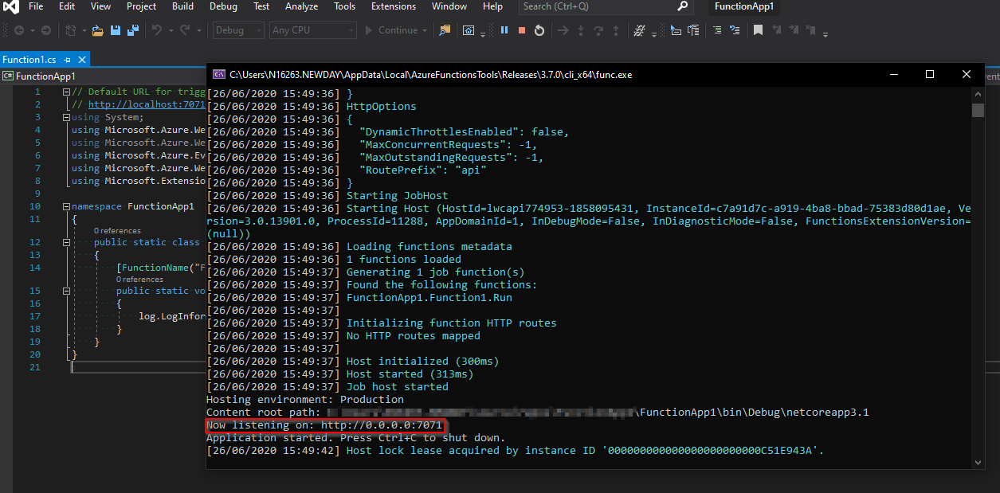
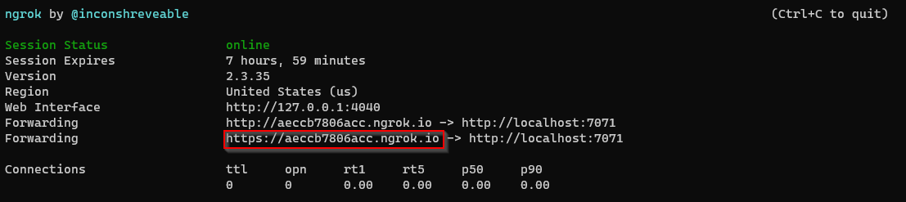
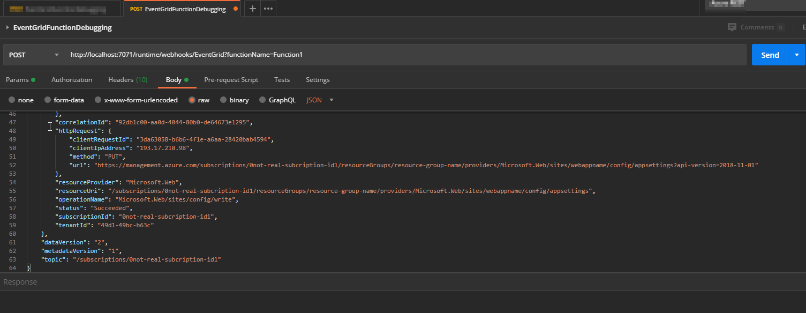

# Event grid trigger Azure function
We can use [Azure Event Grid](https://docs.microsoft.com/en-us/azure/event-grid/overview) with an Azure function as an endpoint to handle the events. With great development tools available for Azure functions with [Visual Studio](https://docs.microsoft.com/en-us/azure/azure-functions/functions-develop-vs), we can debug into our function with a real/mock event grid event trigger.

This post needs an understanding of the basics of Azure functions development and event grid.

# Debugging with a real event from Azure
For this technique, we need to allow Azure to be able to call the function which we have on our local machine. The steps to follow are:

- Start debugging locally in Visual Studio (hit F5).
- Note the port number from the debug console. It normally is `7071`.
</br>

- Now we need to allow Azure to be able to call our function. For this, we use the [ngrok](https://ngrok.com/) utility. Get the utility then run the command
```
ngrok http -host-header=localhost 7071
```
- From the ngrok run output, copy the https URL.
</br>

- We then use this on our Azure event grid subscription endpoint in the lines of
```
https://aeccb7806acc.ngrok.io/runtime/webhooks/EventGrid?functionName=Function1
```

And that's it. When there is a new event, ngrok will redirect the endpoint call to the function on our development machine.

# Debugging locally with mock events
For locally creating mocked up events, we need to understand the schema of the event.

## Creating the event JSON
Check the event schema on [Microsoft documentation](https://docs.microsoft.com/en-us/azure/event-grid/event-schema#event-schema).

```
[
  {
    "topic": string,
    "subject": string,
    "id": string,
    "eventType": string,
    "eventTime": string,
    "data":{
      object-unique-to-each-publisher
    },
    "dataVersion": string,
    "metadataVersion": string
  }
]
```

### Event data
The `data` element varies depending on the different event sources. Say for example we want to mock the events from Azure subscription as an event grid source. An example event can be found in [Microsoft documentation](https://docs.microsoft.com/en-us/azure/event-grid/event-schema-subscriptions#example-event).

It looks like
```
[{
  "subject": "/subscriptions/{subscription-id}/resourcegroups/{resource-group}/providers/Microsoft.Storage/storageAccounts/{storage-name}",
  "eventType": "Microsoft.Resources.ResourceWriteSuccess",
  "eventTime": "2018-07-19T18:38:04.6117357Z",
  "id": "4db48cba-50a2-455a-93b4-de41a3b5b7f6",
  "data": {
    "authorization": {
      "scope": "/subscriptions/{subscription-id}/resourcegroups/{resource-group}/providers/Microsoft.Storage/storageAccounts/{storage-name}",
      "action": "Microsoft.Storage/storageAccounts/write",
      "evidence": {
        "role": "Subscription Admin"
      }
    },
    "claims": {
      "aud": "{audience-claim}",
      "iss": "{issuer-claim}",
      "iat": "{issued-at-claim}",
      "nbf": "{not-before-claim}",
      "exp": "{expiration-claim}",
      "_claim_names": "{\"groups\":\"src1\"}",
      "_claim_sources": "{\"src1\":{\"endpoint\":\"{URI}\"}}",
      "http://schemas.microsoft.com/claims/authnclassreference": "1",
      "aio": "{token}",
      "http://schemas.microsoft.com/claims/authnmethodsreferences": "rsa,mfa",
      "appid": "{ID}",
      "appidacr": "2",
      "http://schemas.microsoft.com/2012/01/devicecontext/claims/identifier": "{ID}",
      "e_exp": "{expiration}",
      "http://schemas.xmlsoap.org/ws/2005/05/identity/claims/surname": "{last-name}",
      "http://schemas.xmlsoap.org/ws/2005/05/identity/claims/givenname": "{first-name}",
      "ipaddr": "{IP-address}",
      "name": "{full-name}",
      "http://schemas.microsoft.com/identity/claims/objectidentifier": "{ID}",
      "onprem_sid": "{ID}",
      "puid": "{ID}",
      "http://schemas.microsoft.com/identity/claims/scope": "user_impersonation",
      "http://schemas.xmlsoap.org/ws/2005/05/identity/claims/nameidentifier": "{ID}",
      "http://schemas.microsoft.com/identity/claims/tenantid": "{ID}",
      "http://schemas.xmlsoap.org/ws/2005/05/identity/claims/name": "{user-name}",
      "http://schemas.xmlsoap.org/ws/2005/05/identity/claims/upn": "{user-name}",
      "uti": "{ID}",
      "ver": "1.0"
    },
    "correlationId": "{ID}",
    "resourceProvider": "Microsoft.Storage",
    "resourceUri": "/subscriptions/{subscription-id}/resourcegroups/{resource-group}/providers/Microsoft.Storage/storageAccounts/{storage-name}",
    "operationName": "Microsoft.Storage/storageAccounts/write",
    "status": "Succeeded",
    "subscriptionId": "{subscription-id}",
    "tenantId": "{tenant-id}"
  },
  "dataVersion": "2",
  "metadataVersion": "1",
  "topic": "/subscriptions/{subscription-id}"
}]
```

### Final event JSON
We have to merge the above two JSON files to form the final one which should look like
```
{
    "subject": "/subscriptions/0not-real-subcription-id1/resourcegroups/resource-group-name/providers/Microsoft.Web/sites/webappname/config/appsettings",
    "eventType": "Microsoft.Resources.ResourceWriteSuccess",
    "eventTime": "2018-07-19T18:38:04.6117357Z",
    "id": "4db48cba-50a2-455a-93w4-de41a3b5b7f6",
    "data": {
        "authorization": {
            "scope": "/subscriptions/0not-real-subcription-id1/resourceGroups/resource-group-name/providers/Microsoft.Web/sites/webappname/config/appsettings",
            "action": "Microsoft.Web/sites/config/write",
            "evidence": {
                "role": "Contributor",
                "roleAssignmentScope": "/subscriptions/0not-real-subcription-id1",
                "roleAssignmentId": "4885d9f5deb94e8d9008e0489072b146",
                "roleDefinitionId": "b24988ac618042a0ab8820f7382dd24c",
                "principalId": "8c80ef36f16f4bd4b237799e24c43cb5",
                "principalType": "Group"
            }
        },
        "claims": {
            "aud": "https://management.core.windows.net/",
            "iss": "https://sts.windows.net/49d1-49bc-b63c/",
            "iat": "1593077152",
            "nbf": "1593077152",
            "exp": "1593081052",
            "http://schemas.microsoft.com/claims/authnclassreference": "1",
            "aio": "AUQAu/sdfdsf+5Bzb5OcRKrcNyHu5w==",
            "http://schemas.microsoft.com/claims/authnmethodsreferences": "pwd,rsa,mfa",
            "appid": "1950a258-227b-4e31-a9cf-717495945fc2",
            "appidacr": "0",
            "http://schemas.xmlsoap.org/ws/2005/05/identity/claims/surname": "Priyadarshee",
            "http://schemas.xmlsoap.org/ws/2005/05/identity/claims/givenname": "Dushyant",
            "groups": "76e57378-7986-491e-sdf-6220d6a8bb13",
            "ipaddr": "193.117.214.98",
            "name": "Priyadarshee, Dushyant",
            "http://schemas.microsoft.com/identity/claims/objectidentifier": "f0dc630a-b9b9-498a-945d-5c86dd3a9cbc",
            "onprem_sid": "S-1-5-21-1102854320-3722712898-1019641694-40955",
            "puid": "10032000C1028AF8",
            "http://schemas.microsoft.com/identity/claims/scope": "user_impersonation",
            "http://schemas.xmlsoap.org/ws/2005/05/identity/claims/nameidentifier": "RctV-GGTWjD_kITSHLSCIJJD4hwLLdO4o7J7Vi5NT5Q",
            "http://schemas.microsoft.com/identity/claims/tenantid": "49d1-49bc-b63c",
            "http://schemas.xmlsoap.org/ws/2005/05/identity/claims/name": "abcdef@abc.def.co.uk",
            "http://schemas.xmlsoap.org/ws/2005/05/identity/claims/upn": "abcdef@abc.def.co.uk",
            "uti": "fPTvpJqJ-kib1Ui5IfnqAA",
            "ver": "1.0",
            "wids": "88d8e3e3-8f55-4a1e-953a-9b9898b8876b"
        },
        "correlationId": "92db1c00-aa0d-4044-80b0-de64673e1295",
        "httpRequest": {
            "clientRequestId": "3da63058-b6b6-4f1e-a6aa-28420bab4594",
            "clientIpAddress": "193.17.210.98",
            "method": "PUT",
            "url": "https://management.azure.com/subscriptions/0not-real-subcription-id1/resourceGroups/resource-group-name/providers/Microsoft.Web/sites/webappname/config/appsettings?api-version=2018-11-01"
        },
        "resourceProvider": "Microsoft.Web",
        "resourceUri": "/subscriptions/0not-real-subcription-id1/resourceGroups/resource-group-name/providers/Microsoft.Web/sites/webappname/config/appsettings",
        "operationName": "Microsoft.Web/sites/config/write",
        "status": "Succeeded",
        "subscriptionId": "0not-real-subcription-id1",
        "tenantId": "49d1-49bc-b63c"
    },
    "dataVersion": "2",
    "metadataVersion": "1",
    "topic": "/subscriptions/0not-real-subcription-id1"
}
```
We would want to replace the values in the JSON as to what our function is likely to expect.

## Using postman to create the request
Now using [postman](https://www.postman.com/) we create the `POST` request.

- We use the URL `http://localhost:7071/runtime/webhooks/EventGrid?functionName=Function1`
- Add the following headers
```
Content-Type = application/json
aeg-event-type = Notification
```
</br>
- We copy paste the json we created earlier into request body
</br>


And that's it, when we click `Send`, we will hit any breakpoints on our Visual Studio instance.

# Conclusion
This has been a learning experience for me and hence considered sharing if it is useful for someone else. I must say the [documentaion](https://docs.microsoft.com/en-us/azure/azure-functions/functions-debug-event-grid-trigger-local) provided by Microsoft is very useful in learning these among other tricks. There is also a great blog post by [Paul Mcilreavy](https://blog.mcilreavy.com/articles/2018-12/debug-eventgrid-triggered-azure-function) regarding this.

Overall, these techniques make debugging experience so much easier and we have all Visual Studio tools at our disposal in these scenarios as well. Definite win-win.
