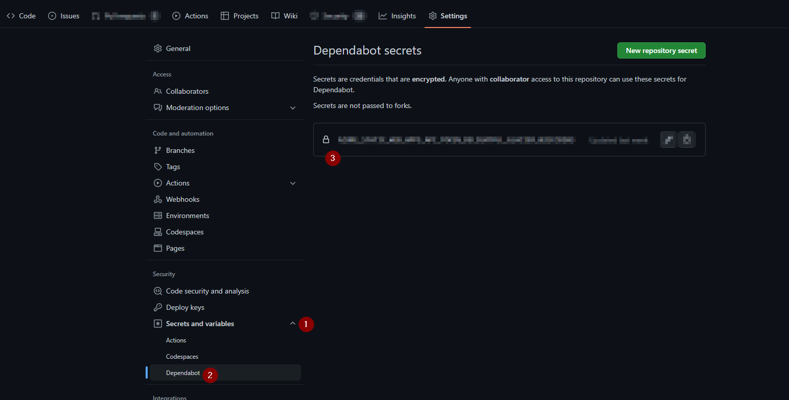

# Introduction
The automated update tool [Dependabot](https://github.com/dependabot) is a very helpful bot and it creates many fixes in the form of pull requests. Recently I learnt why the dependabot pull requests were failing with an error

```
deployment_token was not provided.
```

# The setup and issue

The [github workflow](https://github.com/realrubberduckdev/dp-blog/blob/a3e2177a93888f4102b2025c350a77b6a84b7817/.github/workflows/azure-static-web-apps-delightful-glacier-02eccb203.yml) is deploying an [Azure static webapp](https://learn.microsoft.com/en-us/azure/static-web-apps/overview).

```
- name: Deploy
        id: deploy
        uses: Azure/static-web-apps-deploy@v1
        with:
          azure_static_web_apps_api_token: ${{ secrets.AZURE_STATIC_WEB_APPS_API_TOKEN_DELIGHTFUL_GLACIER_02ECCB203 }}
          repo_token: ${{ secrets.GITHUB_TOKEN }} # Used for Github integrations (i.e. PR comments)
          action: "upload"
          ###### Repository/Build Configurations - These values can be configured to match your app requirements. ######
          # For more information regarding Static Web App workflow configurations, please visit: https://aka.ms/swaworkflowconfig
          app_location: "/public" # App source code path
          skip_app_build: true
          skip_api_build: true
          ###### End of Repository/Build Configurations ######
```

This means that it needs a valid access token to be able to create resources on Azure during the workflow execution. And it is unable to find that secret and hences the error:

```
deployment_token was not provided.
The deployment_token is required for deploying content. If you'd like to continue the run without deployment, add the configuration skip_deploy_on_missing_secrets set to true in your workflow file
An unknown exception has occurred
```

# The solution
Took me a few search attempts to locate [this comment on GitHub](https://github.com/Azure/static-web-apps/issues/788#issuecomment-1216570180). Essentially, dependabot doesn't use the default set of secrets, rather we need to explicitly provide a set of secrets for it to use. It makes sense, we won't want an app sitting outside of our repo to have access to repo/organization secrets.

The solution is to provide the required secrets for dependabot to use:

</br>



</br>

# Conclusion
Hope this was useful and saved you some time. Please do share your learnings. If you have any thoughts or comments please do get in touch with me on Twitter [@rubberduckdev](https://twitter.com/rubberduckdev). Or use the Disqus plugin below.