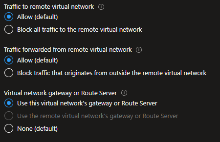
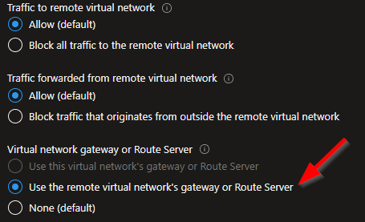

# Introduction
After an Azure ExpressRoute is setup we can use [Get-AzExpressRouteCircuitRouteTable](https://learn.microsoft.com/en-us/powershell/module/az.network/get-azexpressroutecircuitroutetable) Cmdlet to view what routes are advertised on the ExpressRoute. It lists the destinations a data packet can reach if it took that route. And those data packets take the ExpressRoute only when the destination is available on the route table.

Recently, my team and I came across this issue where a certain spoke IP range wasn't listed on the route table.


# ExpressRoute route table in a hub-spoke network topology

So while using [hub-spoke model](https://docs.microsoft.com/en-us/azure/architecture/reference-architectures/hybrid-networking/hub-spoke?tabs=cli) say our setup is as follow:

```
Hub vnet is 10.10.0.0/22
Spoke1 vnet is 10.20.0.0/22
Spoke2 vnet is 10.30.0.0/22
```

Say our on-premises IP ranges are as follows, to which ExpressRoute is the path from our Azure infrastructure:
```
162.20.0.0/21
```

Now traffic from a spoke, say Spoke1 will flow to on-prem and back only if the ExpressRoute route table has entries for `10.20.0.0/22`and `162.20.0.0/21` respectively. These routes are learnt by the ExpressRoute automatically once we deploy the [vnet peerings](https://learn.microsoft.com/en-us/azure/virtual-network/virtual-network-peering-overview).

But when we run the `Get-AzExpressRouteCircuitRouteTable` Cmdlet we see

# The issue

After setting up the infrastructure as described above, traffic was not flowing from on-premises to a resource on Spoke1. The issue was understandable as the ExpressRoute circuit table wasn't showing entries for the spokes.

i.e.

```
Get-AzExpressRouteCircuitRouteTable -DevicePath Primary -ExpressRouteCircuitName my-express-route -PeeringType AzurePrivatePeering -ResourceGroupName my-rg

Network : 162.20.0.0/21
NextHop : 10.300.120.250

```

So in the output above, we see that ExpressRoute knows that to get to the on-prem resources, it can use a next hop (which in this case is the ExpressRoute private peering). But it doesn't know how to get to Azure resources from on-prem. This could manifest in multiple ways while testing, such as:

```
Invoke-WebRequest : The underlying connection was closed: The connection was closed unexpectedly.
```

or

```
Invoke-WebRequest : Unable to connect to the remote server
```

Now we understand the reason, let's see what is the solution.

# Solution - check vnet peering

The hub to spoke vnet peering should look like this:

<br/>



<br/>
The issue we found is that the spokes were not using the hub's gateway. This is a setting we need on the spoke side of vnet peering. And by default, it is set to none.

<br/>



<br/>

Once we have got the spokes to use the hub's gateway, the resulting route table for ExpressRoute should show a `NextHop` for Spoke vnet IP ranges as below. The NextHop being the hub vnet gateway IP.

```
Get-AzExpressRouteCircuitRouteTable -DevicePath Primary -ExpressRouteCircuitName my-express-route -PeeringType AzurePrivatePeering -ResourceGroupName my-rg

Network : 162.20.0.0/21
NextHop : 10.300.120.250

Network : 10.20.0.0/22
NextHop : 10.10.0.10

Network : 10.30.0.0/22
NextHop : 10.10.0.10
```

So the solution is to set `Use the remote virtual network's gateway or Route Server` using your favourite IaC.

# Conclusion
Hope this was useful and saved you some time. Please do share your learnings. If you have any thoughts or comments please do get in touch with me on Twitter [@rubberduckdev](https://twitter.com/rubberduckdev). Or use the Disqus plugin below.