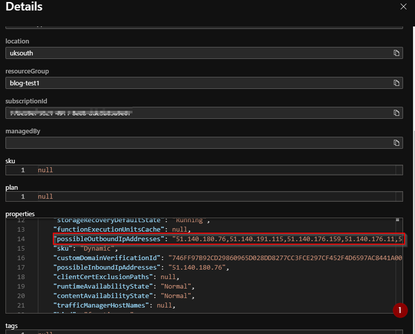

# Introduction
The IP address of an Azure function can be very useful, especially if you are using [IP based network restrictions](https://docs.microsoft.com/en-us/azure/app-service/app-service-ip-restrictions) or any kind of firewall to block requests from unknown IPs. Azure gives us a [single inbound IP](https://docs.microsoft.com/en-us/azure/azure-functions/ip-addresses#function-app-inbound-ip-address) address to the function, but a [range of possible outbound](https://docs.microsoft.com/en-us/azure/azure-functions/ip-addresses#find-outbound-ip-addresses) ones. This is so that Azure can do its internal load balancing. The issue you might hit is that these IPs can all change.

# When can IP change

There are specific cases when IPs can change. Again these are listed in the [documentation](https://docs.microsoft.com/en-us/azure/azure-functions/ip-addresses#inbound-ip-address-changes). Both the inbound and outbound IP addresses can change. So how do we figure out, on the fly, what are the IPs of our Azure function?

# Resource graph

This is when [Azure Resource Graph](https://azure.microsoft.com/en-gb/features/resource-graph/) becomes super useful. The resource graph is a powerful management tool to query, explore and analyse your cloud resources at scale. We can see all resources, their properties etc using [Kusto query language (KQL)](https://docs.microsoft.com/en-us/azure/data-explorer/kusto/query/) queries.

## Using resource graph

Steps to finding out the IPs of our function are as follows. Note that we have a function app named `blog-test-funap`.

* Go to `Azure Resource Graph Explorer` on your Azure portal
* Enter query
```
Resources | where name =~ 'blog-test-funap' and type =~ 'microsoft.web/sites'
```

</br>

Notice the `=~` which means, do a case insensitive comparison. And we filter the resources down to `microsoft.web/sites`, which is what function apps are under the hood.

* Scroll and click on `See details`

</br>

* See possible IP addresses in `Properties`

</br>

Note that there are multiple JSON properties to get full list of IP addresses such as `possibleOutboundIpAddresses`, `possibleInboundIpAddresses` and `outboundIpAddresses`.

# Conclusion
Azure resource graph gives a lot of power at your fingertips. This post was a demonstration at Azure portal, but we can do the same using [AZ CLI](https://docs.microsoft.com/en-us/cli/azure/ext/resource-graph/graph?view=azure-cli-latest), [Azure Powershell](https://docs.microsoft.com/en-us/azure/governance/resource-graph/first-query-powershell) or [dotnet sdk](https://docs.microsoft.com/en-us/azure/governance/resource-graph/first-query-dotnet) or [REST API](https://docs.microsoft.com/en-us/rest/api/azure-resourcegraph/). Thereby having full knowledge of our Azure resources with automation. 

Hope this was useful. Please do share your learnings. If you have any thoughts or comments please do get in touch with me on twitter [@rubberduckdev](https://twitter.com/rubberduckdev). Or use the Disqus plugin below.
