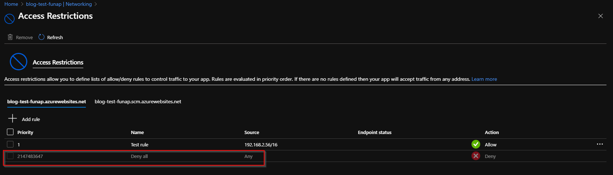
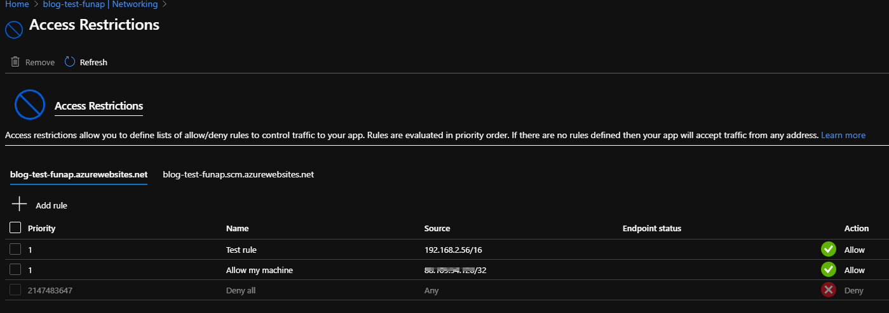

# Introduction
Secured access to azure functions is very important, especially when your distributed application can have a public-facing infrastructure. Be it public IP addresses or user interface. [Azure RBAC](https://docs.microsoft.com/en-us/azure/role-based-access-control/overview) roles provide a great way to control who can trigger your function or what your function can do. On top of that, [network access restrictions](https://docs.microsoft.com/en-us/azure/app-service/app-service-ip-restrictions) add the perfect layer of security to avoid unwanted sources to be able to trigger your function.

# Developer access
During the development phase, any access restrictions set up can cause issues for the developers. For example, if we create a sample function and add a restriction rule (check screenshot), then a `Deny all` is automatically added at the end of the restrictions list. The logic being, if we want specific IPs/Vnets etc to be allowed in, then we must want the rest of the sources to be locked out. 


</br>
It makes sense. But the issue is as a developer, you can no longer test run the function on your azure portal.

As the source of the trigger, the Azure portal is now from your developer machine. So you see the following error: 
```
You must have direct network access in order to run your function. Your app may be restricted with Private Endpoints, Access Restrictions or Service Endpoints.
```


## Allow list yourself

As we know why our request is being blocked, the simplest solution is to allow list ourself.

Steps:
* Get your public ip, I used google

</br>
* Add to network restrictions

</br>

Ensure you use the [CIDR](https://en.wikipedia.org/wiki/Classless_Inter-Domain_Routing) to allow list only the specific IP and not a range. For security, you do not want more than your IP getting the access to your function.

If the concept is new, here is a fantastic video explaining how the subnetting is calculated using CIDR notation.
`video: https://youtu.be/nFYilGQ-p-8`


</br>
This is how it should look after the rule is added.
* Note that you may have to wait few minutes for the rule to propagate. Then trigger the function from the portal:

</br>

And that's it, now you should be able to trigger your function.

### Quick detour to wording conventions

As a quick detour, the [tech industry has recently started using more explicit terminology](https://www.bbc.co.uk/news/technology-53050955) and removing old wordings which both do not make complete sense and can be offensive. Hence the term, allow list. It will be a slow change, let's try.

## Remove before production

Once your development phase is done, definitely remove any unwanted IPs you have added. I normally recommend having a unit test which can use [REST API](https://docs.microsoft.com/en-us/rest/api/azure/) to assert what rules should be present, before the function is deployed to production.

# Conclusion
Hope this was useful. I am slowly learning new techniques to work with functions. Please do share your learnings. If you have any thoughts or comments please do get in touch with me on twitter [@rubberduckdev](https://twitter.com/rubberduckdev). Or use the Disqus plugin below.