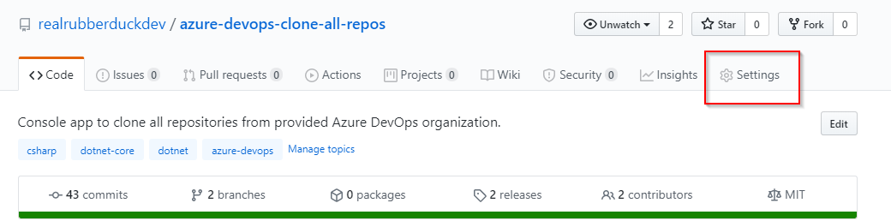
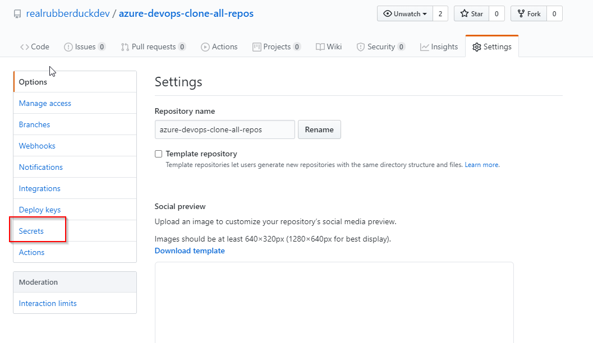
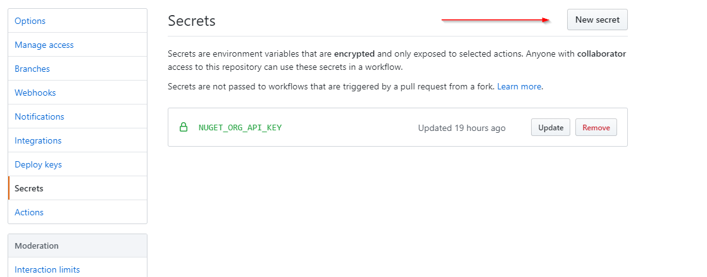

# GitHub Actions
GitHub provides [GitHub Actions](https://github.com/features/actions) to help with automating workflows. We can design CI-CD pipelines and also apply policies on branches using them. The action workflows can be saved to a git repo as a yml file. Along with build, test & deploy, GitHub Actions can help with code reviews, branch management and issue triaging as well.

# Basics
The basics of GitHub Actions are covered in [Core concepts for GitHub Actions](https://help.github.com/en/actions/getting-started-with-github-actions/core-concepts-for-github-actions). The overall summary is as follows:

- **Step**: A step is an individual task that can run commands or actions. Actions are the smallest portable building block of a workflow.
- **Job**: A set of steps that execute on the same runner constitute a job.
- **Workflow**: A configurable automated process, consisting of one or more jobs.
- **Workflow File**: The YAML file that defines your workflow configuration with at least one job. This file lives in the root of your GitHub repository in the .github/workflows directory.

# Simple action
Let's have a look at a simple workflow file.

```
name: ADOSCloneAllRepos CI-CD

on:
  push:
    branches: [ master ]
  pull_request:
    branches: [ master ]

jobs:
  build:

    runs-on: windows-latest

    steps:
    - uses: actions/checkout@v2
    - name: Setup .NET Core
      uses: actions/setup-dotnet@v1
      with:
        dotnet-version: 3.1.101
    - name: Install dependencies
      run: dotnet restore
    - name: Build
      run: dotnet build --configuration Release --no-restore
    - name: Test
      run: dotnet test --no-restore --verbosity normal
    - name: Upload math result for job 2
      uses: actions/upload-artifact@v1
      with:
        name: ADOSCloneAllRepos
        path: ADOSCloneAllRepos\bin\Release\netcoreapp3.1
```

This workflow, named as `ADOSCloneAllRepos CI-CD`, gets triggered on when we push changes to master or create a pull request on the master. This is controlled by the `on` block,
```
on:
  push:
    branches: [ master ]
  pull_request:
    branches: [ master ]
```

After the `on`, we need to start the `jobs` jobs and it needs to specify which kind of agent it needs to run on. Here we specify `runs-on: windows-latest`.
The `steps` now have a set of `uses` which are actions from [GitHub Marketplace](https://github.com/marketplace?type=actions). Some are predefined, such as `run` which executes a command in a prompt.

The key thing to understand here is, unlike [publish build artefacts task in Azure pipelines](https://docs.microsoft.com/en-us/azure/devops/pipelines/tasks/utility/publish-build-artifacts?view=azure-devops), GitHub Actions uses [actions/upload-artifact@v1](https://github.com/marketplace/actions/upload-a-build-artifact). Because theoretically, the workflow is uploading the artifact to GitHub.

So this workflow, builds, tests and publishes a dotnet core artifact.

# Automated versioning using GitVersion
A major challenge in CI-CD and package management is versioning. In simple cases we can use [GitVersion](https://gitversion.net/docs/) and we can also use it in GitHub Actions workflow. The steps have to change a bit for this:

```
    steps:
    - uses: actions/checkout@v2
    - name: Fetch all history for all tags and branches
      run: git fetch --prune --unshallow
    - name: Install GitVersion
      uses: gittools/actions/gitversion/setup@v0.9.2
      with:
          versionSpec: '5.2.x'
    - name: Use GitVersion
      id: gitversion # step id used as reference for output values
      uses: gittools/actions/gitversion/execute@v0.9.2
    - name: Setup .NET Core
      uses: actions/setup-dotnet@v1
      with:
        dotnet-version: 3.1.101
    - name: Install dependencies
      run: dotnet restore
    - name: Build
      run: dotnet build --configuration Release --no-restore -p:Version=${{ steps.gitversion.outputs.semVer }}
```

After the checkout, we need to fetch all history, hence the `run: git fetch --prune --unshallow`. Then we install `GitVersion 5.2.x`, more on this is available at [use-actions on the marketplace](https://github.com/marketplace/actions/use-actions).
Then we run GitVersion,
```
- name: Use GitVersion
      id: gitversion # step id used as reference for output values
      uses: gittools/actions/gitversion/execute@v0.9.2
```

Notice that we provide an id for the step so that we can access the output of the step in the `build` step as `${{ steps.gitversion.outputs.semVer }}`.

# GitHub action secret management
Secret management is an essential part of any CI-CD pipeline. Especially when it is open source on GitHub. Fortunately, it is very easy to manage our secrets on GitHub Actions. The steps are:

- Add secret on repository's Secrets settings:



<br/>
- Then access secret in workflow file as `${{ secrets.NUGET_ORG_API_KEY }}`.

Note that [GITHUB_TOKEN](https://help.github.com/en/actions/configuring-and-managing-workflows/authenticating-with-the-github_token#about-the-github_token-secret) is a special predefined secret.

# Multijob action
A single workflow can have one or more jobs. For the case we have been working on, let's have two jobs. One to `Build and test` and second one to `Publish to nuget.org`.

```
jobs:
  build:
    name: Build and test
    runs-on: windows-latest

    steps:
    - name: Setup .NET Core
      uses: actions/setup-dotnet@v1
      with:
        dotnet-version: 3.1.101
    - name: Install dependencies
      run: dotnet restore
    - name: Build
      run: dotnet build --configuration Release --no-restore -p:Version=1.0.0
    - name: Test
      run: dotnet test --no-restore --verbosity normal
    - name: Upload ADOSCloneAllRepos
      uses: actions/upload-artifact@v2
      with:
        name: ADOSCloneAllRepos
        path: ADOSCloneAllRepos\bin\Release\ADOSCloneAllRepos.1.0.0.nupkg

  publish_package:
    name: Publish to nuget.org
    needs: build
    runs-on: windows-latest

    steps:
      - name: Download build artifact
        uses: actions/download-artifact@v1
        with:
          name: ADOSCloneAllRepos
      - name: Setup .NET Core
        uses: actions/setup-dotnet@v1
        with:
          dotnet-version: 3.1.101
      - name: Push package to nuget.org
        run: dotnet nuget push ./ADOSCloneAllRepos/ADOSCloneAllRepos.1.0.0.nupkg -k ${{ secrets.NUGET_ORG_API_KEY }} -s https://api.nuget.org/v3/index.json
```
The first job, builds, tests and uploads artifact to GitHub. The second `publish_package` job gets the artifact from the previous job and publishes to nuget.org.
Notice the `needs: build`. That tells the workflow that `publish_package` has a dependency on `build` job and hence has to run sequentially. The jobs will run in parallel by default.

## Conditional job
We can run the `publish_package` job conditionally, say only if the merge is to master then only we publish the package by adding `if: github.ref == 'refs/heads/master'` before steps as below:

```
  publish_package:
    name: Publish to nuget.org
    needs: build
    runs-on: windows-latest

    if: github.ref == 'refs/heads/master'
    steps:
```

# Final action yml
Let's put all these together into one final workflow yml. The objective being, we build and test for a push to any branch or PR to master. But we publish only on push to master.

```
name: ADOSCloneAllRepos CI-CD

on:
  push:
    branches: [ '*' ]
  pull_request:
    branches: [ master ]

jobs:
  build:
    name: Build and test
    runs-on: windows-latest
    # Map a step output to a job output
    outputs:
      semVer: ${{ steps.gitversion.outputs.semVer }}

    steps:
    - uses: actions/checkout@v2
    - name: Fetch all history for all tags and branches
      run: git fetch --prune --unshallow
    - name: Install GitVersion
      uses: gittools/actions/gitversion/setup@v0.9.2
      with:
          versionSpec: '5.2.x'
    - name: Use GitVersion
      id: gitversion # step id used as reference for output values
      uses: gittools/actions/gitversion/execute@v0.9.2
    - name: Setup .NET Core
      uses: actions/setup-dotnet@v1
      with:
        dotnet-version: 3.1.101
    - name: Install dependencies
      run: dotnet restore
    - name: Build
      run: dotnet build --configuration Release --no-restore -p:Version=${{ steps.gitversion.outputs.semVer }}
    - name: Test
      run: dotnet test --no-restore --verbosity normal
    - name: Upload ADOSCloneAllRepos
      uses: actions/upload-artifact@v2
      with:
        name: ADOSCloneAllRepos
        path: ADOSCloneAllRepos\bin\Release\ADOSCloneAllRepos.${{ steps.gitversion.outputs.semVer }}.nupkg

  publish_package:
    name: Publish to nuget.org
    needs: build
    runs-on: windows-latest

    if: github.ref == 'refs/heads/master'
    steps:
      - name: Download build artifact
        uses: actions/download-artifact@v1
        with:
          name: ADOSCloneAllRepos
      - name: Setup .NET Core
        uses: actions/setup-dotnet@v1
        with:
          dotnet-version: 3.1.101
      - name: Push package to nuget.org
        run: dotnet nuget push ./ADOSCloneAllRepos/ADOSCloneAllRepos.${{needs.build.outputs.semVer}}.nupkg -k ${{ secrets.NUGET_ORG_API_KEY }} -s https://api.nuget.org/v3/index.json
      - name: Tag commit
        uses: tvdias/github-tagger@v0.0.1
        with:
          repo-token: "${{ secrets.GITHUB_TOKEN }}"
          tag: "${{needs.build.outputs.semVer}}"
```

Notice the mapping of job output at build, where it maps GitVersion output to a variable called `semVer` which can then be accessed at the next job.
```
build:
    name: Build and test
    runs-on: windows-latest
    # Map a step output to a job output
    outputs:
      semVer: ${{ steps.gitversion.outputs.semVer }}
```

# Conclusion
GitHub Actions are really powerful and make automation easy on GitHub (also on GitHub Enterprise). For full code check [azure-devops-clone-all-repos](https://github.com/realrubberduckdev/azure-devops-clone-all-repos). [GitHub Actions documentation](https://help.github.com/en/actions) is a great starting point as well. Special thanks to [Timboski](https://twitter.com/Timboski) for helping with the project.
