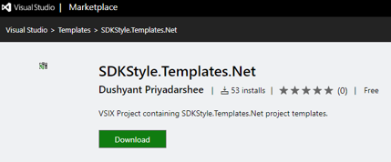
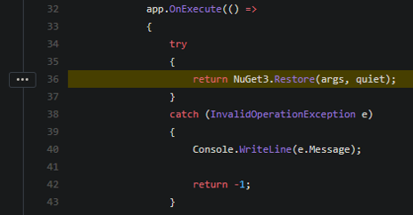

# Obfuscation
We are in the golden age of open source software and yet at least I (surely many others too) work at places where safeguarding intellectual property (IP) in software is of paramount importance. One of the main techniques used to safeguard IP is by [obfuscating the code](https://en.wikipedia.org/wiki/Obfuscation_(software)) we ship. We can achieve this by a simple nuget as well. Let's dig into the details in this post.

# Nuget
This post mainly aims at .net framework project, msbuild and nuget.

## .Net framework
You may think why are we still talking about .net framework when [.NET Core is the Future of .NET](https://devblogs.microsoft.com/dotnet/net-core-is-the-future-of-net/) & [.NET 5 is round the corner](https://devblogs.microsoft.com/dotnet/introducing-net-5/). We are getting cool features with the latest developments in the dotnet world, but again from experience, we know that migration and adoption of the newer technologies will take some time, I mean years. Until then we will have a codebase of only .net framework or a mix of .net framework and dotnet core/standard etc.
<br/>
[](https://marketplace.visualstudio.com/items?itemName=rubberduckdev.SDKStyleTemplatesNet)
<br/><br/>
Having said so, the sdk style csproj is very useful, feel free to check [my earlier blog post](https://www.rubberduckdev.com/sdkstyle-framework-csproj/) regarding that. But as of now, we do not have an sdk style csproj template shipped in Visual Studio for .net framework projects. I use the [simple visual studio extension](https://marketplace.visualstudio.com/items?itemName=rubberduckdev.SDKStyleTemplatesNet) above, which is open source and any comments/suggestions are welcome on that.

## NuGet techniques
Before we jump into the obfuscation nuget development, let me show a few useful tips with nuget, which we will use.

## GeneratePackageOnBuild
In sdk style csproj, we can add `<GeneratePackageOnBuild>true</GeneratePackageOnBuild>` which can automatically generate the nupkg file for us upon build. This makes it much easier, especially if you come from the times when we had to use nuspec files. Now all references, nuget properties etc can all stay in the csproj. Refer [Automatically generate package on build](https://docs.microsoft.com/en-us/nuget/quickstart/create-and-publish-a-package-using-the-dotnet-cli#automatically-generate-package-on-build) for documentation.

## NuGet package folder structure
Microsoft has a [convention-based directory structure](https://docs.microsoft.com/en-us/nuget/create-packages/creating-a-package#from-a-convention-based-working-directory) for the nupkg file. A nupkg file is essentially a zip file and the different folders mean something specific. For example, the one we are going to use the `build` folder that can have targets and props file which will be triggered during the build of the project that references our nupkg. *Note* that the props or targets file name in the build folder has to be the same as the package id.

## MSBuild props and targets in nupkg
This is what we discussed a bit in the previous point. Any props files in the build folder are imported at the top of the consuming project and any targets are imported at the end of the csproj. The convention is that they have to be named after the package id, else they will be ignored.

## IncludeBuildOutput
Another important property which we can include in sdk style csproj is `<IncludeBuildOutput>false</IncludeBuildOutput>`. This is so that if say the objective of the nupkg is just to ship a targets file (which is what we will do in a bit), it doesn't need to include any build output. *Note* that without this property, by default class library projects will include an empty dll in the nupkg.

## Demo plan
As presented, in the architecture diagram below, we will have a .net framework project that generates a nupkg. This package is referenced by a second .net framework project. When the second project builds, it automatically triggers the obfuscation of the generated dll.

<br/>

## Code
The full code is on [github](https://github.com/realrubberduckdev/NuGetAndMSBuild) and I will run through the csproj file here which generates the nuget package to help obfuscate the output dll of the referencing project.

### RDD.Obfuscation.AfterBuild.csproj
```
<Project Sdk="Microsoft.NET.Sdk">
  <PropertyGroup>
    <TargetFramework>net48</TargetFramework>
    <GeneratePackageOnBuild>true</GeneratePackageOnBuild>
    <PackageId>RDD.Obfuscation.AfterBuild</PackageId>
    <IncludeBuildOutput>false</IncludeBuildOutput>
  </PropertyGroup>
  <ItemGroup>
    <PackageReference Include="ConfuserEx.Final" Version="1.0.0" />
  </ItemGroup>
  <ItemGroup>
    <None Include="RDD.Obfuscation.AfterBuild.targets" Pack="True" PackagePath="build" />
  </ItemGroup>
</Project>
```
The RDD.Obfuscation.AfterBuild.csproj produces the obfuscation helper nuget package. The nupkg is a simple nuget package with a targets file shown below.
```
<?xml version="1.0" encoding="utf-8"?>
<Project ToolsVersion="4.0" DefaultTargets="Build" xmlns="http://schemas.microsoft.com/developer/msbuild/2003">
  <PropertyGroup>

    <!-- ConfuserToolsPath -->
    <ConfuserToolsPath>$(MSBuildThisFileDirectory)..\..\..\ConfuserEx.Final\1.0.0\tools</ConfuserToolsPath>
    <ConfuserExePath>$(ConfuserToolsPath)\Confuser.CLI.exe</ConfuserExePath>

    <!-- Confuser command -->
    <ConfuserCommand Condition=" '$(OS)' == 'Windows_NT'">"$(ConfuserExePath)"</ConfuserCommand>

    <!-- ProjectFileName -->
    <ProjectFileName>$(ProjectDir)Confuser.crproj</ProjectFileName>

    <!-- Commands -->
    <ConfuseCommand>$(ConfuserCommand) "$(ProjectFileName)"</ConfuseCommand>
  </PropertyGroup>

  <Target Name="Confuser" AfterTargets="AfterBuild">
    <Exec WorkingDirectory="$(ProjectDir)" Command="$(ConfuseCommand)" />
  </Target>
</Project>
```

The targets file locates `Confuser.CLI.exe` at nuget packages location and the needed `Confuser.crproj` at the consuming project's root. Then it triggers obfuscation after target `AfterBuild` has finished. Thus ensuring the generated dll gets obfuscated.

# MSBuild & dotnet build
To generate the nuget, we can simply run `msbuild RDD.Obfuscation.AfterBuild.csproj` and it will give us `RDD.Obfuscation.AfterBuild.1.0.0.nupkg`. We could also pass in parameters such as verion `msbuild RDD.Obfuscation.AfterBuild.csproj /P:Version=2.0.0`.

Can we do these using dotnet? Yes, we can. Let me demonstrate the relation between msbuild and dotnet by showcasing how nuget restore is implemented.

<br/>
In 2016, [dotnet restore used nuget restore](https://github.com/dotnet/cli/blob/6cde21225e18fc48eeab3f4345ece3e6bb122e53/src/dotnet/commands/dotnet-restore/Program.cs#L36
) under the hood.
<br/>
<br/>
In 2019, this has [changed to using msbuild restore](https://github.com/dotnet/sdk/blob/master/src/Cli/dotnet/commands/dotnet-restore/Program.cs#L41
).
<br/>

So, in essence, we are using msbuild under dotnet. But to do msbuild bits, as far as I know, we need to use [dotnet msbuild command](https://docs.microsoft.com/en-us/dotnet/core/tools/dotnet-msbuild). Which can be an inconvenience if you have mixed (framework and dotnet) codebase.

# Recommendations
Here are a few recommendations if you are using dotnet, msbuild, nuget etc in your development environment.

- Migrate to sdk style csproj
- Use MSBuild if the codebase is .Net Framework or mix of core/standard and framework, else use dotnet.
- Migrate to core/standard where possible
- Avoid using multiple tools, msbuild, dotnet and nuget. Very likely you can use just one of those.


# Talk video
I presented a talk on this topic at [.Net Oxford](https://www.dotnetoxford.com/posts/2020-05-lightning-talks). Thanks to [Dan Clarke](https://twitter.com/dracan), the video of the talk is now published on youtube.

`video: https://youtu.be/Bo2kuGnOfKs`

# Conclusion
In conclusion, nuget, msbuild, dotnet together give us a powerful combination of tools to make obfuscation or any other similar operations faster, easier & reusable. Any common shared tool, utility, libraries etc can be easily shared using nuget and I would highly recommend we did so instead of direct assembly/project references. And if you have something amazing to share, definitely publish it to nuget.org and share with all.