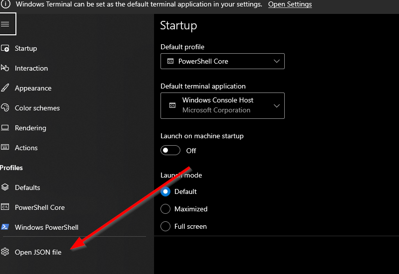

# Introduction
This post is more for my notes and hopefully helps someone out figure out how to set up [Visual Studio](https://visualstudio.microsoft.com/) environment from [pwsh](https://github.com/PowerShell/PowerShell) in [Windows Terminal](https://github.com/microsoft/terminal).

# Steps
- From windows terminal hit Ctrl+, to open settings pane. I normally use the json file.
<br/>
- **Default Profile:** Add pwsh profile as you default one
<br/>
- Then open `pwsh` and use command
```
code $PROFILE
```
This will open up the profile startup script
- Add the following to the profile startup script.
```
$vsInstallPath = "C:\Program Files\Microsoft Visual Studio\2022\Community"
Import-Module "$vsInstallPath/Common7/Tools/Microsoft.VisualStudio.DevShell.dll"
Enter-VsDevShell -VsInstallPath $vsInstallPath -SkipAutomaticLocation -StartInPath "C:\Dev"
```
*Note:* The `StartInPath` parameter is for my local folder where I normally checkout code.
*Note:* This is specific to VS 2022. May need changing as per VS installation.
# Conclusion
Hope this was useful and saves you some time. Please do share your learnings. If you have any thoughts or comments please do get in touch with me on twitter [@rubberduckdev](https://twitter.com/rubberduckdev). Or use the Disqus plugin below.
