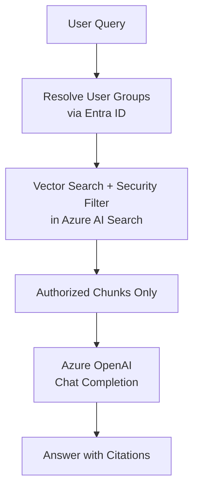

<div className="seo-hidden">
Build a secure Retrieval-Augmented Generation (RAG) system using Azure AI Search, Azure OpenAI, and .NET. Learn how to implement security trimming with Microsoft Entra ID group-based access control so users only see documents they're authorized to access.
</div>

# Building Secure RAG with Azure AI Search and .NET

Retrieval-Augmented Generation (RAG) has become the go-to pattern for building AI applications that answer questions grounded in your own data. But when that data contains sensitive information — HR policies, financial reports, internal procedures — you can't just let any user query any document. You need **security trimming**: ensuring the AI only retrieves and reasons over documents the user is authorized to see.

This post walks through building a **Secure RAG** system using Azure AI Search, Azure OpenAI, and .NET, where every document chunk is tagged with access control information and filtered at query time using Microsoft Entra ID group membership.

---

## The Secure RAG Pattern

Secure RAG works like a smart, security-conscious librarian. Here's the high-level flow:

1. **Ingestion** — Documents are chunked, embedded, tagged with access control lists (ACLs), and stored in Azure AI Search.
2. **Authentication** — At query time, the user's identity is resolved and their group memberships are fetched from Microsoft Entra ID.
3. **Retrieval with Security Trimming** — A vector search is performed, but a filter ensures only chunks the user has access to are returned.
4. **Generation** — The allowed chunks are sent to Azure OpenAI, which generates an answer grounded only in the authorized context.

The key insight: the LLM **never** sees documents the user shouldn't access. Security trimming happens at the search layer, before the data ever reaches the model.

---

## Architecture Overview



| Step | What Happens | Azure Service |
|------|-------------|---------------|
| Chunk | Split long documents into paragraph-sized pieces | C# code |
| Embed | Convert each chunk into a vector | Azure OpenAI |
| Tag | Attach `groupIds` / `userIds` to each chunk | C# code |
| Store | Save text + vector + tags | Azure AI Search |
| Authenticate | Resolve user's groups from Entra ID | Microsoft Entra ID |
| Retrieve | Vector search **with security filter** | Azure AI Search |
| Generate | LLM answers using only allowed chunks | Azure OpenAI |

---

## Setting Up the Azure AI Search Index

The foundation of secure RAG is an Azure AI Search index that includes a **security field** — a collection of group IDs that determines who can see each document chunk.

### Creating the Index

```csharp
using Azure;
using Azure.AI.OpenAI;
using Azure.Search.Documents;
using Azure.Search.Documents.Indexes;
using Azure.Search.Documents.Indexes.Models;
using System.ClientModel;

string searchEndpoint = "https://YOUR-SEARCH.search.windows.net";
string searchKey = "YOUR-SEARCH-ADMIN-KEY";
string indexName = "secure-rag-index";

async Task CreateIndexAsync()
{
    var indexClient = new SearchIndexClient(
        new Uri(searchEndpoint),
        new AzureKeyCredential(searchKey));

    var fields = new List<SearchField>
    {
        new SimpleField("id", SearchFieldDataType.String) { IsKey = true },
        new SearchableField("content") { IsSearchable = true },
        new SimpleField("source", SearchFieldDataType.String)
        {
            IsFilterable = true,
            IsRetrievable = true
        },
        // *** SECURITY FIELD – this is the magic ***
        new SearchField("groupIds",
            SearchFieldDataType.Collection(SearchFieldDataType.String))
        {
            IsFilterable = true,
            IsRetrievable = false  // hide from results for security
        },
        // Vector field for semantic search
        new SearchField("contentVector",
            SearchFieldDataType.Collection(SearchFieldDataType.Single))
        {
            IsSearchable = true,
            VectorSearchDimensions = 1536,
            VectorSearchProfileName = "my-vector-profile"
        }
    };

    var index = new SearchIndex(indexName)
    {
        Fields = fields,
        VectorSearch = new VectorSearch
        {
            Profiles =
            {
                new VectorSearchProfile("my-vector-profile", "my-hnsw-config")
            },
            Algorithms =
            {
                new HnswAlgorithmConfiguration("my-hnsw-config")
            }
        }
    };

    await indexClient.CreateOrUpdateIndexAsync(index);
    Console.WriteLine("Index created/updated.");
}
```

The `groupIds` field is a **collection of strings** that stores the Entra ID group object IDs allowed to see each chunk. Setting `IsRetrievable = false` ensures this field is never returned in search results, keeping the ACL information hidden from clients.

---

## Chunking and Tagging Documents

Before documents can be searched, they need to be broken into manageable chunks and tagged with the appropriate access control information.

### Simple Fixed-Size Chunking

```csharp
List<string> ChunkText(string text, int chunkSize = 800, int overlap = 100)
{
    var chunks = new List<string>();
    int start = 0;

    while (start < text.Length)
    {
        int length = Math.Min(chunkSize, text.Length - start);
        chunks.Add(text.Substring(start, length).Trim());
        start += chunkSize - overlap;
    }

    return chunks;
}
```

This approach splits text into overlapping chunks of approximately 800 characters with 100 characters of overlap. The overlap ensures that information spanning chunk boundaries isn't lost.

### The Document Model

```csharp
public class SecureChunk
{
    public string id { get; set; } = Guid.NewGuid().ToString();
    public string content { get; set; } = string.Empty;
    public string source { get; set; } = string.Empty;
    public string[] groupIds { get; set; } = Array.Empty<string>();
    public float[] contentVector { get; set; } = Array.Empty<float>();
}
```

The `groupIds` array is where the security tagging happens. Each chunk carries the list of group IDs that are permitted to read it.

---

## Generating Embeddings with Azure OpenAI

Each chunk needs to be converted into a vector embedding so it can be searched semantically.

```csharp
string openAiEndpoint = "https://YOUR-OPENAI.openai.azure.com/";
string openAiKey = "YOUR-OPENAI-KEY";
string embeddingDeployment = "text-embedding-3-small";  // 1536 dimensions

async Task<float[]> GetEmbeddingAsync(string text)
{
    var client = new AzureOpenAIClient(
        new Uri(openAiEndpoint),
        new ApiKeyCredential(openAiKey));

    var embeddingClient = client.GetEmbeddingClient(embeddingDeployment);
    var response = await embeddingClient.GenerateEmbeddingAsync(text);

    return response.Value.ToFloats().ToArray();
}
```

The `text-embedding-3-small` model produces 1536-dimensional vectors, which matches the `VectorSearchDimensions` we configured in the index.

---

## Ingesting Documents with Security Tags

Now we bring it all together — chunking, embedding, tagging, and uploading.

```csharp
async Task IngestDocumentAsync(
    string documentText,
    string sourceName,
    string[] allowedGroupIds)
{
    var searchClient = new SearchClient(
        new Uri(searchEndpoint),
        indexName,
        new AzureKeyCredential(searchKey));

    var chunks = ChunkText(documentText);
    var documents = new List<SecureChunk>();

    foreach (var chunk in chunks)
    {
        var vector = await GetEmbeddingAsync(chunk);

        documents.Add(new SecureChunk
        {
            content = chunk,
            source = sourceName,
            groupIds = allowedGroupIds,  // <-- TAG the chunk here
            contentVector = vector
        });
    }

    await searchClient.UploadDocumentsAsync(documents);
    Console.WriteLine(
        $"Uploaded {documents.Count} secured chunks for {sourceName}");
}
```

### Example: Ingesting Documents with Different Access Levels

```csharp
async Task RunIngestion()
{
    await CreateIndexAsync();

    // HR document – only HR group can see it
    string hrDoc = "Parental leave is 16 weeks fully paid...";
    await IngestDocumentAsync(
        hrDoc,
        "HR-Policy.pdf",
        new[] { "hr-team-guid-123" });

    // Public document – everyone can see it
    string publicDoc = "Our product supports Windows, Mac and Linux...";
    await IngestDocumentAsync(
        publicDoc,
        "Product-Manual.pdf",
        new[] { "everyone-group-guid" });
}
```

Each document is tagged with the group IDs that are allowed to access it. The HR policy is restricted to the HR team, while the product manual is available to everyone.

---

## Secure Query Time: Retrieval with Security Trimming

At query time, the user's group memberships are used to construct a **security filter** that ensures only authorized chunks are returned.

### Resolving User Groups from Entra ID

In a real application, you'd use Microsoft Graph to resolve the user's group memberships. Here's a simplified example:

```csharp
// In a real app, use Microsoft Graph SDK to fetch user's groups
// from Microsoft Entra ID
string[] userGroupIds = await GetUserGroupIdsAsync(userId);
```

The `GetUserGroupIdsAsync` method would call the Microsoft Graph API (`/me/memberOf` or `/users/{id}/memberOf`) to retrieve all security groups the user belongs to.

### Constructing the Security Filter

```csharp
async Task<string> AskSecureQuestionAsync(
    string userQuestion,
    string[] userGroupIds)
{
    var searchClient = new SearchClient(
        new Uri(searchEndpoint),
        indexName,
        new AzureKeyCredential(searchKey));

    // 1. Create the security filter
    // Only return chunks where groupIds contains ANY of the user's groups
    string filter = $"groupIds/any(g: search.in(g, " +
        $"'{string.Join(",", userGroupIds)}'))";

    var options = new SearchOptions
    {
        Filter = filter,  // <-- security trimming happens here
        Size = 5,
        VectorSearch = new()
        {
            Queries =
            {
                new VectorizedQuery(await GetEmbeddingAsync(userQuestion))
                {
                    KNearestNeighborsCount = 5,
                    Fields = { "contentVector" }
                }
            }
        }
    };

    // 2. Search – only allowed chunks come back
    var response = await searchClient.SearchAsync<SecureChunk>(
        userQuestion, options);

    var context = new StringBuilder();
    await foreach (var result in response.Value.GetResultsAsync())
    {
        context.AppendLine(result.Document.content);
        context.AppendLine($"Source: {result.Document.source}");
        context.AppendLine("---");
    }

    // 3. Call Azure OpenAI with the safe context
    var openAiClient = new AzureOpenAIClient(
        new Uri(openAiEndpoint),
        new ApiKeyCredential(openAiKey));
    var chatClient = openAiClient.GetChatClient("gpt-4o");

    var messages = new ChatMessage[]
    {
        new SystemChatMessage(
            "You are a helpful assistant. Answer ONLY using the " +
            "provided context. If the answer is not in the context, " +
            "say you don't know."),
        new UserChatMessage(
            $"Context:\n{context}\n\nQuestion: {userQuestion}")
    };

    var completion = await chatClient.CompleteChatAsync(messages);
    return completion.Value.Content[0].Text;
}
```

The filter `groupIds/any(g: search.in(g, 'group1,group2,...'))` uses Azure AI Search's `search.in` function to check if any of the user's group IDs match the `groupIds` collection on each chunk. This is the **security trimming** step — chunks that don't match are excluded from the results entirely.

---

## How It Works in Practice

Let's trace through the example scenario from the notes:

### HR Employee Asking About Parental Leave

```csharp
string[] hrUserGroups = { "hr-team-guid-123", "everyone-group-guid" };
string answer = await AskSecureQuestionAsync(
    "What is the parental leave policy?",
    hrUserGroups);
```

The HR employee belongs to both the HR team group and the everyone group. The security filter allows chunks tagged with either group ID, so the HR policy chunks are returned. The AI generates an answer based on the HR document.

### Regular Employee Asking the Same Question

```csharp
string[] normalUserGroups = { "everyone-group-guid" };
string answer2 = await AskSecureQuestionAsync(
    "What is the parental leave policy?",
    normalUserGroups);
```

The regular employee only belongs to the everyone group. The HR policy chunks are filtered out because they're tagged with `hr-team-guid-123`, which doesn't match. The AI either says it doesn't know or answers only from public documents.

---

## Key Considerations

### 1. Use the Right Embedding Model

The `text-embedding-3-small` model produces 1536-dimensional vectors. Make sure your index's `VectorSearchDimensions` matches the embedding model's output dimensions.

### 2. Hide the Security Field

Setting `IsRetrievable = false` on the `groupIds` field prevents the ACL information from being exposed in search results. This is a defense-in-depth measure.

### 3. Batch Your Ingestion

For large document sets, upload documents in batches to avoid timeouts and improve throughput:

```csharp
// Upload in batches of 1000 documents
const int batchSize = 1000;
for (int i = 0; i < documents.Count; i += batchSize)
{
    var batch = documents.Skip(i).Take(batchSize).ToList();
    await searchClient.UploadDocumentsAsync(batch);
}
```

### 4. Cache User Group Memberships

Resolving group memberships from Entra ID on every query adds latency. Cache the results for the duration of the user's session or use a short-lived cache (e.g., 5-10 minutes).

### 5. Consider User-Based ACLs

While this example uses group-based access control, you can also tag chunks with individual user IDs for more granular control. The filter would then check both `groupIds` and `userIds` collections.

---

## Conclusion

Secure RAG with Azure AI Search and .NET provides a robust foundation for building enterprise AI applications that respect your organization's access control policies. By tagging document chunks with Entra ID group IDs and filtering at query time, you ensure that the LLM only ever sees data the user is authorized to access.

The pattern is straightforward:

1. **Tag** documents with access control information during ingestion
2. **Filter** at search time using the user's group memberships
3. **Generate** answers grounded only in authorized context

This zero-trust approach to RAG means you can confidently deploy AI-powered Q&A systems over sensitive corporate data without worrying about data leakage.

---

## References

- [Azure AI Search documentation](https://learn.microsoft.com/azure/search/)
- [Azure OpenAI Service documentation](https://learn.microsoft.com/azure/ai-services/openai/)
- [Microsoft Entra ID (Azure AD) documentation](https://learn.microsoft.com/azure/active-directory/)
- [Microsoft Graph API - List user's groups](https://learn.microsoft.com/graph/api/user-list-memberof)
- [Azure.Search.Documents .NET SDK](https://learn.microsoft.com/dotnet/api/azure.search.documents)
- [Azure.AI.OpenAI .NET SDK](https://learn.microsoft.com/dotnet/api/azure.ai.openai)

---

## Credits

Banner image from [Unsplash](https://unsplash.com/photos/digital-interface-with-ask-anything-prompt--lZmnpignB8)