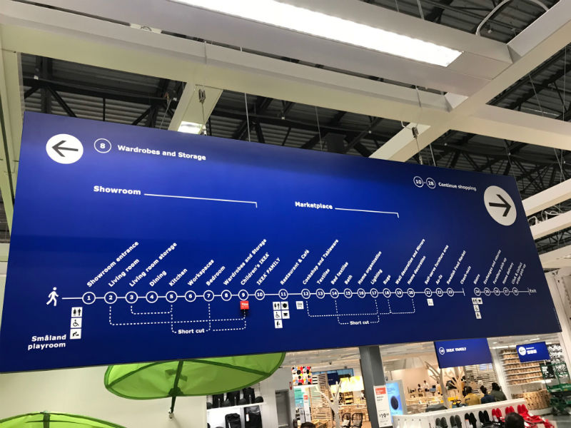
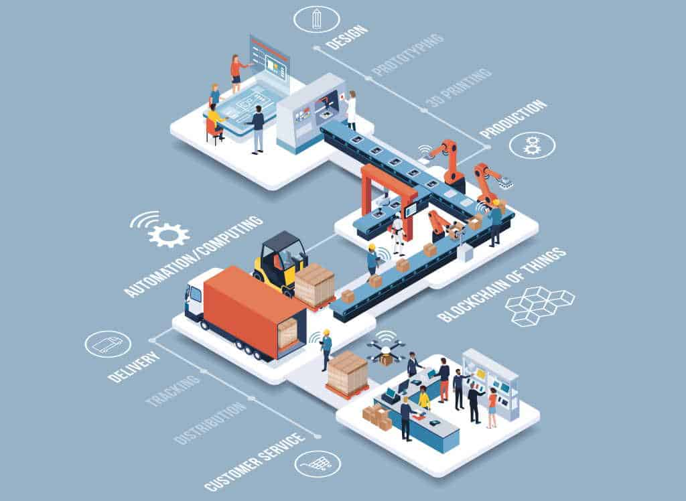

<div className="seo-hidden">
Compare single multi-stage pipelines and multiple Azure DevOps pipelines, with a practical look at traceability, governance, human behaviour, artifact consistency, and maintenance overhead.
</div>

## Introduction

As software delivery becomes faster and more complex, teams often need to decide how their Azure DevOps pipelines should be structured. One common question is whether each activity should have its own pipeline, or whether the whole delivery lifecycle should live in one multi-stage pipeline.

Both approaches can work. For most application delivery workflows, though, I prefer a [single multi-stage pipeline](https://learn.microsoft.com/en-us/azure/devops/pipelines/process/create-multistage-pipeline?view=azure-devops) because it gives better traceability, stronger consistency, and a simpler operational model.

---

## The Problem with Multiple Pipelines

Many teams start with separate pipelines for separate responsibilities:

- Continuous Integration
- Testing
- Development deployment
- Staging deployment
- Production deployment

At first, this feels clean. Each pipeline has a focused job and can be managed independently. The problems usually appear as the application and team grow.

### Fragmented visibility

With multiple pipelines, understanding a release means jumping between several pipeline runs and correlating build artifacts, test results, and deployment history.

Simple questions become harder than they should be:

- Which build was deployed to production?
- Did staging use the same artifact as development?
- Which tests ran before deployment?

That extra investigation cost shows up during incidents, audits, and ordinary release reviews.

### More maintenance

Separate pipelines often create repeated YAML and repeated operational work:

- Duplicate deployment logic
- Repeated triggers
- Additional permissions management
- More service connections
- More places to update when the delivery process changes

The individual pipelines may each look simple, but the system as a whole becomes harder to maintain.

### Higher risk of inconsistency

When each environment is deployed by a different pipeline, it is easier for environments to drift.

```text
Development -> Build 105
Staging     -> Build 106
Production  -> Build 104
```

This makes troubleshooting more difficult. It also weakens confidence that production is receiving the same validated artifact that passed through earlier environments.

---

## The Single Multi-Stage Pipeline Approach

A multi-stage pipeline keeps the full delivery lifecycle in one pipeline execution.

```text
Build
  |
Tests
  |
Development
  |
Staging
  |
Production
```

Each stage still has a clear responsibility, but the release moves through one connected workflow.

A simplified Azure DevOps YAML structure might look like this:

```yaml
stages:
- stage: Build

- stage: Test

- stage: DeployDev

- stage: DeployStaging

- stage: DeployProduction
```

The important part is not just that the YAML is in one file. The important part is that one release has one path from source code to production.

---

## Key Benefits

### End-to-end traceability

A single multi-stage pipeline makes the state of a release visible in one place.

```text
Release #125

Build                  Succeeded
Unit Tests             Succeeded
Security Scan          Succeeded
Deploy Development     Succeeded
Deploy Staging         Succeeded
Production Approval    Waiting
```

There is no need to search across multiple pipelines to understand what happened. The release history, test execution, approvals, and deployments are all tied to the same run.

### Build once, deploy everywhere

A strong CI/CD pattern is to build the artifact once and promote it through environments.

```text
Artifact A
  |
Development
  |
Staging
  |
Production
```

This reduces version drift because every environment receives the same artifact. The deployment configuration can still vary per environment, but the application package should remain consistent.

### Stronger governance

Deployment workflows often need approvals, audit trails, quality checks, and change controls. A multi-stage pipeline centralizes those controls.

```text
Build
  |
Development
  |
Staging
  |
Manual Approval
  |
Production
```

This is especially useful when production releases need a clear approval record. The approval becomes part of the same auditable workflow as the build and deployments that came before it.

### Less duplication

Deployment logic is usually similar across environments. Instead of copying the same steps into several pipelines, a multi-stage pipeline can reuse templates and pass environment-specific values as parameters.

That gives you:

- Less YAML to maintain
- Fewer places for bugs to hide
- Easier process changes
- More consistent deployments

When deployment logic changes, it can be changed once and reused across stages.

### Better developer experience

A single pipeline is easier for engineers to understand and operate.

```text
One pipeline -> Build -> Test -> Dev -> Staging -> Production
```

Instead of remembering which pipeline performs which part of the release, the team has one source of truth. That helps during onboarding and makes troubleshooting more direct.

### Clearer release visibility

Release visibility is not only useful for engineers. Product managers, support teams, and platform teams also benefit from seeing where a release is in the delivery lifecycle.

A single pipeline gives everyone a shared view without needing extra reports or manual correlation.

---

## Why This Aligns with Human Behaviour

There is also a human side to this design choice: people work better when they can follow one visible journey instead of mentally stitching together disconnected processes. A multi-stage pipeline supports that by giving a release one clear path from build to production.

Every handoff adds cognitive load. Every disconnected system increases context switching. Every missing link creates another place where information can be lost or misunderstood.

### Real-world examples

- **IKEA store layout**: One map guides customers through the showroom, marketplace, warehouse, and checkout. Separate maps for each section would make the journey feel fragmented.

  </br>

- **London tube map**: Passengers follow one connected map across lines, stations, and interchanges. Separate maps for every line segment would make the journey harder to plan and easier to misunderstand.

  </br>

- **GPS navigation**: A sat-nav gives one route from start to destination. Most people would not choose a different navigation app for every road segment.

  </br>

- **Manufacturing assembly lines**: A product moves through a visible sequence of stages, making it easier to see progress and identify where a problem exists.

  </br>

- **Project management boards**: Teams prefer one board showing backlog, in progress, testing, and done. Separate boards for each stage make overall status harder to understand.

  </br>

### Applying this to CI/CD

A single multi-stage pipeline gives the delivery process the same kind of visible journey:

- One source of truth for a release
- One audit trail from build to deployment
- One place to see approvals, tests, and deployment status
- Less context switching for engineers
- Reduced risk of losing information between stages

In behavioural terms, the pipeline reduces cognitive load and improves visibility. Engineers spend less time figuring out where a release is and more time understanding whether it is ready to move forward.

---

## When Multiple Pipelines Still Make Sense

Multi-stage pipelines are not a rule for every scenario. Separate pipelines can still be the better design when there is a real ownership or release boundary.

### Independent release cadences

Different components may need to ship on different schedules.

```text
Frontend Team
Backend Team
Data Team
```

If those components are independently owned and released, separate pipelines may be simpler.

### Different ownership models

Some organizations split delivery responsibilities between teams. If each team needs full operational independence, separate pipelines can make that boundary explicit.

### Reusable platform services

Shared infrastructure or platform services that support many applications may also justify dedicated pipelines. In that case, the separation is based on product ownership rather than arbitrary delivery stages.

---

## Recommended Architecture

For most application delivery workflows, a good starting point is:

```text
Build
  |
Quality Checks
  |
Automated Tests
  |
Development
  |
Staging
  |
Production Approval
  |
Production
```

This works well when combined with:

- Pipeline templates
- Environment approvals
- Automated quality gates
- Infrastructure as Code
- Rolling or canary deployment strategies

The goal is not to make the pipeline file bigger. The goal is to make the release process easier to reason about.

---

## Conclusion

A single multi-stage pipeline aligns well with modern DevOps delivery because it improves traceability, keeps artifacts consistent across environments, centralizes approvals, and reduces duplicated pipeline logic.

Multiple pipelines still have valid uses when components have independent ownership or independent release cadences. But for most application delivery workflows, consolidating the lifecycle into one multi-stage pipeline creates a more reliable and transparent release process.

The outcome is not just fewer pipelines. It is a delivery model that is easier to audit, easier to operate, and easier to trust. It also reduces the cognitive load of release management by giving everyone one visible journey to follow.
