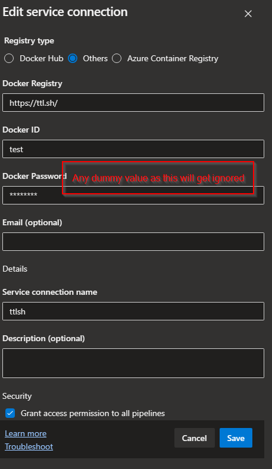

# Introduction

When it comes to testing Docker images, having a reliable platform to quickly spin up containers for testing purposes can be invaluable. Enter [ttl.sh](https://ttl.sh/), a convenient service that allows you to host and test Docker images with ease. In this blog post, we'll explore how to leverage ttl.sh within Azure Pipelines to streamline your testing workflow.

### What is ttl.sh?

Ttl.sh is a service designed to simplify Docker image testing. It provides a temporary container registry (hence the name "ttl," which stands for "time to live") where you can push your Docker images for testing purposes. Once pushed, ttl.sh automatically spins up containers from your images, allowing you to validate their functionality and compatibility. Bear in mind that the image will get purged after 24hrs or less depending on the tag.

### Setting Up Azure Pipelines with ttl.sh

To integrate ttl.sh into your Azure Pipelines workflow, follow these steps:

1. **Create Dummy Credentials in Azure DevOps Service Connection**: Start by creating a dummy service connection in Azure DevOps. This connection will be used to authenticate and push Docker images to ttl.sh. While the credentials don't need to be real, ensure they have the necessary permissions to push images to your chosen container registry.

<br/>

2. **Configure Your Pipeline**: Below is a basic example of an Azure Pipelines YAML configuration that builds a Docker image and pushes it to ttl.sh:

```yaml
trigger:
- main

pool:
  vmImage: ubuntu-latest

steps:
- task: Docker@2
  inputs:
    containerRegistry: 'ttlsh'
    repository: '2cc2bc2c-cc5d-4c47-81ed-6ea9aaead977'
    command: 'buildAndPush'
    Dockerfile: './Dockerfile'
    tags: '8h'
```

In this example:
- The pipeline triggers on changes to the `main` branch.
- It utilizes an Ubuntu latest image.
- The Docker task builds the image using the specified Dockerfile and pushes it to the ttl.sh registry. The `tags` parameter specifies how long the image should be available on ttl.sh before expiring.

3. **Customize as Needed**: Customize the pipeline according to your project's requirements. You can add additional steps for testing, deployment, or any other tasks necessary for your workflow.

### Conclusion

Integrating ttl.sh into your Azure Pipelines workflow provides a convenient solution for testing Docker images. By following the steps outlined above, you can easily push Docker images to ttl.sh and validate their functionality within temporary containers. This streamlined testing process helps ensure the reliability and compatibility of your Docker images before deploying them to production environments. Happy testing!