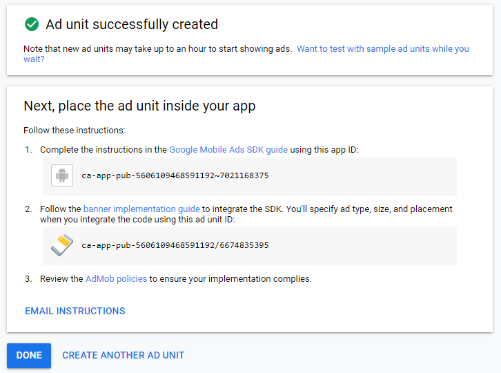

# Introduction
Xamarin has made monetization of mobile cross-platform apps very easy. Mainly with nuget packages such as [Xamarin.GooglePlayServices.Ads.Lite](https://www.nuget.org/packages/Xamarin.GooglePlayServices.Ads.Lite/), adding [admob banner ads](https://support.google.com/admob/answer/6128877) has become a breeze.

# The Xamarin Show
James Montemagno has a great video on the Xamarin show explaining how to add banner ads on android apps.

`video: https://youtu.be/6teJvSCg6UA`

# SimpleJigsaw
With help and inspiration from James Montemagno, two of my close friends [Sanjeeb Swain](https://sanjeebsks204.wixsite.com/sanjeeb-swain) & [Suryakiran Maruvada](https://www.zigzagrainbow.com/) and I set out to design our first android app.

[](https://play.google.com/store/apps/details?id=com.rubberduckdev.simplejigsaw)
<br/>

# Monetizing SimpleJigsaw
Following the video above and a few other tutorials, we managed to add ads in our app.

Obviously, we got AdMob id details with a banner unit:

<br/>
And then added these along with the ad control view, ad view renderer and other updates in a commit. This is available on [github for reference](https://github.com/realrubberduckdev/xamarin-admob-demo/commit/e3f2fa1cd9f564c522f2e56522ea8f285e24e782).

# AdMob Policy Issue
Although the commit above works perfectly on the local machine and for a day or so did work in the published app, there was an issue. Within a few days, I received an email from Google.


<br/>

On visiting the policy centre, we found the following message:
```
Modified ad code: Resizing Ad Frames
MODIFIED ADS: Publishers are not permitted to alter the behaviour of Google ads in any way. This includes resizing ad frames to cut off parts of ads or hiding the Ads by Google moniker.
```

Quite baffling for untrained and hobbyist Xamarin developers. Because violating policy was never the intention. Then we started following the policies in more detail at [Google AdMob help](https://support.google.com/admob/answer/6128543?hl=en). Finally, we understood that the ad banner under no circumstances should be clipped/resized and that can be avoided by ensuring it gets the height it gets.

To achieve this we added `IsClippedToBounds="False"` to the grid view containing the ad banner.
```
<Grid IsClippedToBounds="False">
    <Grid.ColumnDefinitions>
        <ColumnDefinition Width="*" />
    </Grid.ColumnDefinitions>
    <Grid.RowDefinitions>
        <RowDefinition Height="Auto" />
    </Grid.RowDefinitions>
    <local:AdControlView x:Name="adControlView" Grid.Row="0"/>
</Grid>
```

And in the next bit was ensure it gets the size it wants. The smart banner sizing is described at [Google AdMob help](https://developers.google.com/admob/android/banner#banner_sizes).

<br/>

```
    class AdViewRenderer : ViewRenderer
    {
        private Context _context;

        public AdViewRenderer(Context context) : base(context)
        {
            _context = context;
        }

        protected override void OnElementChanged(ElementChangedEventArgs<View> e)
        {
            base.OnElementChanged(e);
            if (Control == null)
            {
                var ad = new AdView(_context);
                ad.AdSize = AdSize.SmartBanner;
                ad.AdUnitId = SimpleJigsawConstants.adMobBannerUnitId;
                var requestbuilder = new AdRequest.Builder();
                ad.LoadAd(requestbuilder.Build());
                e.NewElement.HeightRequest = GetSmartBannerDpHeight();

                SetNativeControl(ad);
            }
        }

        private int GetSmartBannerDpHeight()
        {
            var dpHeight = Resources.DisplayMetrics.HeightPixels / Resources.DisplayMetrics.Density;

            if (dpHeight <= 400) return 32;
            if (dpHeight > 400 && dpHeight <= 720) return 50;
            return 90;
        }
    }
```

In order to obtain the correct size of banner, we introduced a new function `GetSmartBannerDpHeight()` in the `AdViewRenderer` class. This would automatically get the correct height as that is dynamic.

One more thing to note is that in the `XAML` file, we started naming the `adControlView`:
```
<local:AdControlView x:Name="adControlView" Grid.Row="0"/>
```
This is because we learnt from a [community post](https://www.b4x.com/android/forum/threads/solved-google-admob-restricted-ad-serving-modified-ad-code-resizing-ad-frames.112884/post-704612) that if an ad banner is active, the user must not be restricted to click on it, else it will cause a policy violation. So we use that name in a wrapper function to ensure the banner gets hidden if we are to show an alert.

```
private async Task<bool> PerformCustomDisplayAlert(string title, string message, string accept, string cancel)
{
    // https://www.b4x.com/android/forum/threads/solved-google-admob-restricted-ad-serving-modified-ad-code-resizing-ad-frames.112884/
    // Hide ad before showing alert, else Google thinks we are blocking user access to their ads.
    adControlView.IsVisible = false;
    var res = await DisplayAlert(title, message, accept, cancel);
    adControlView.IsVisible = true;
    return res;
}
```

And since these changes, our ad seems to work fine on our app. The full [demo code is available on github](https://github.com/realrubberduckdev/xamarin-admob-demo).

# Conclusion
As you may have already got, this was a learning experience. And this development is as a hobby, we welcome any help and advise you can provide. Definitely try out the app if you can and provide feedback.

Hope this was useful and saves you some time if you are trying this out. Please do share your learnings. If you have any thoughts or comments please do get in touch with me on Twitter [@rubberduckdev](https://twitter.com/rubberduckdev). Or use the Disqus plugin below.
